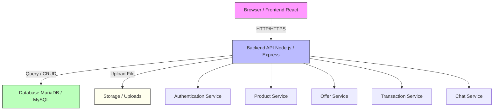
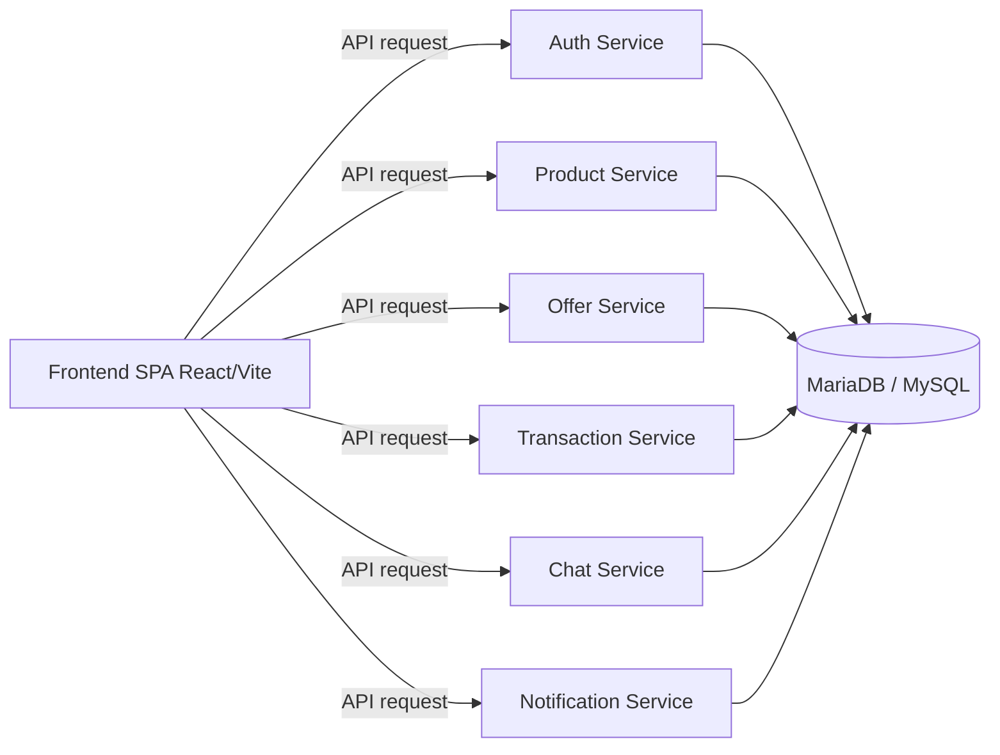
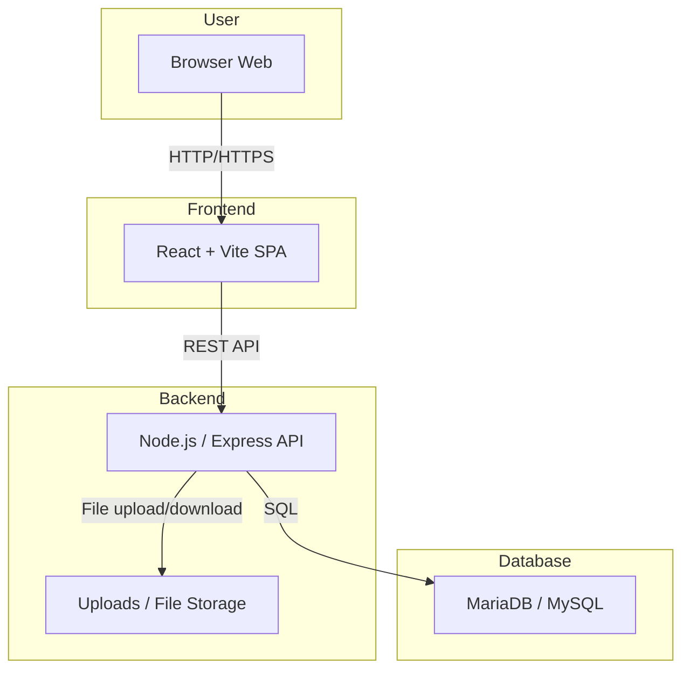

# A. Arsitektur Sistem

Dokumen ini menjelaskan struktur aplikasi BabePus secara keseluruhan, termasuk arsitektur frontend, backend, dan database.

## 1. Struktur Umum Aplikasi

Arsitektur logis utama aplikasi:

Frontend → Backend API → Database

Penjelasan singkat:
- Frontend: antarmuka web yang berjalan di browser dan berkomunikasi dengan backend melalui REST API.
- Backend API: server Node.js / Express yang menangani autentikasi, produk, penawaran, transaksi, dan chat.
- Database: MariaDB/MySQL yang menyimpan data pengguna, produk, penawaran, transaksi, dan chat.

## 2. Diagram Arsitektur

## 3. Diagram Microservice (Logical Services)

> Catatan: Backend pada implementasi ini dijalankan dalam satu aplikasi Express tetapi dibagi secara logis menjadi beberapa layanan yang bertanggung jawab atas domain berbeda.

## 4. Diagram Deployment

## 5. Komponen Utama

- **Frontend**
  - Single Page Application (SPA) React.
  - Menggunakan `vite` sebagai bundler.
  - Modul utama: halaman login, register, marketplace, dashboard, dan detail produk.

- **Backend**
  - Node.js dengan Express.
  - Router dan controller untuk autentikasi, produk, penawaran, transaksi, dan chat.
  - Middleware untuk autentikasi dan upload file.

- **Database**
  - MariaDB / MySQL.
  - Menyimpan tabel pengguna, produk, kategori, penawaran, transaksi, dan pesan chat.

- **Upload / Storage**
  - Folder `uploads/` untuk menyimpan gambar produk dan file pendukung lainnya.

## 6. Aliran Data Utama

1. Pengguna membuka aplikasi di browser.
2. Frontend memuat halaman dan meminta data melalui REST API ke backend.
3. Backend memproses permintaan, memvalidasi input, dan membaca/menulis data ke database.
4. Backend mengembalikan hasil ke frontend.
5. Untuk upload gambar atau file, frontend mengirim data ke endpoint upload backend.

## 7. Ringkasan

Arsitektur sistem BabePus adalah aplikasi web klasik dengan satu frontend React yang berkomunikasi dengan satu backend Node.js/Express, dan menggunakan MariaDB/MySQL sebagai lapisan penyimpanan data.

Dokumen ini bisa dikembangkan lebih lanjut dengan diagram arsitektur fisik, service boundary, serta detil deployment ke hosting atau cloud jika diperlukan.
