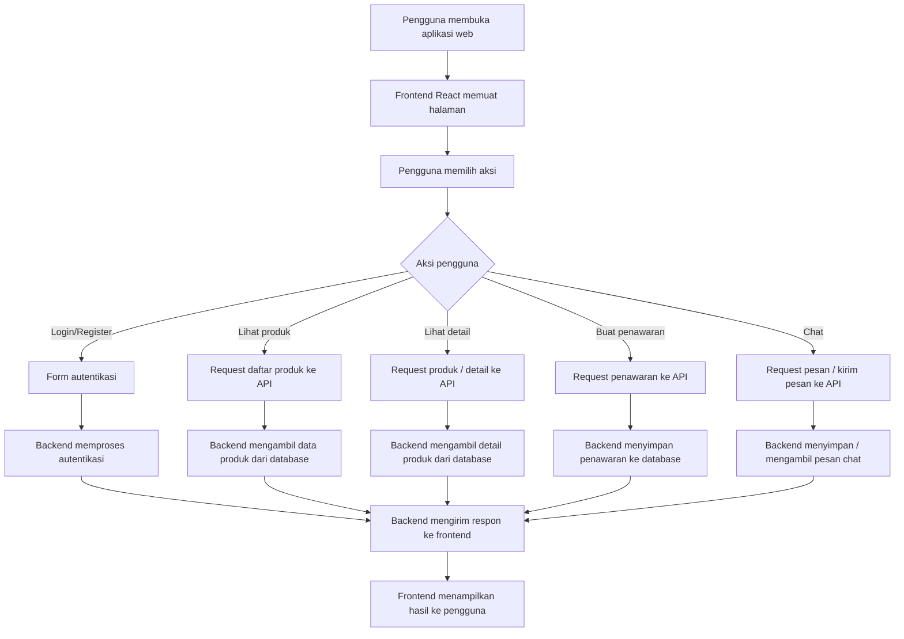
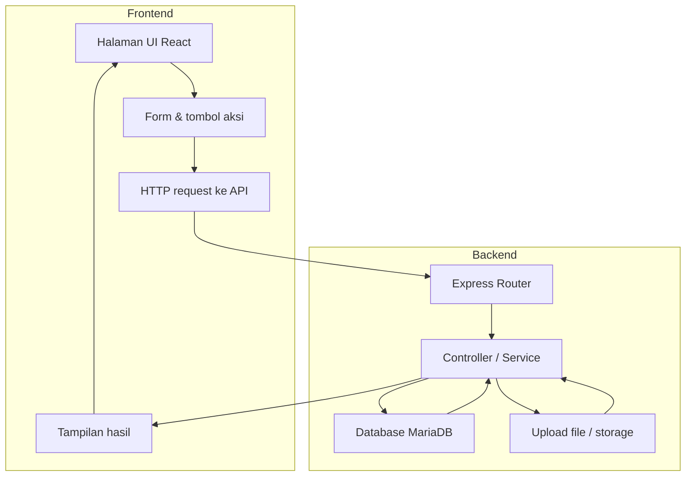
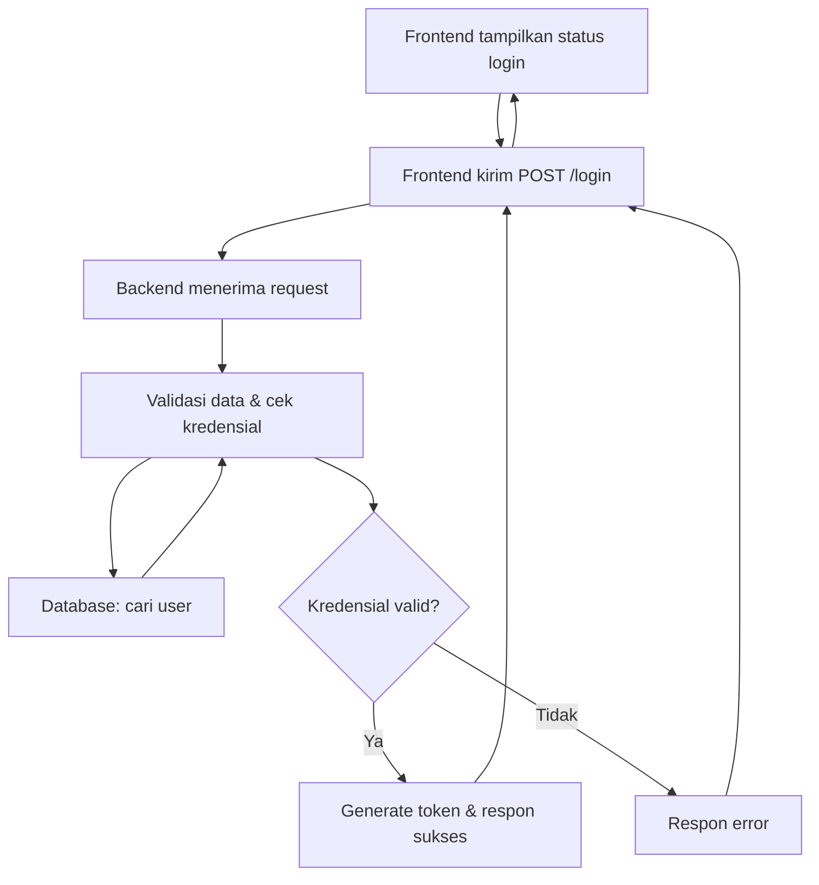
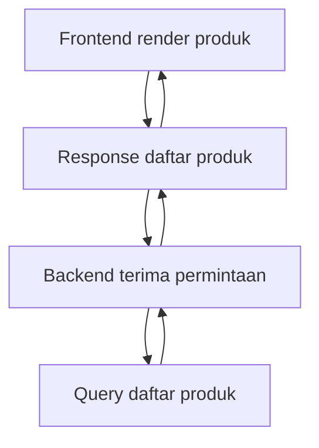

# B. Flowchart

Dokumen ini menjelaskan alur kerja aplikasi BabePus secara visual dan langkah demi langkah.

## 1. Alur Kerja Umum

## 2. Flowchart Interaksi Frontend dan Backend

## 3. Penjelasan Langkah Alur Utama

1. Pengguna membuka aplikasi BabePus dan frontend React akan memuat halaman awal.
2. Pengguna melakukan aksi seperti login, melihat produk, membuat penawaran, atau chat.
3. Frontend mengirim request HTTP/HTTPS ke backend API untuk memproses aksi.
4. Backend menerima permintaan, menjalankan kontroler yang sesuai, dan berinteraksi dengan database atau storage.
5. Backend mengembalikan hasil atau data ke frontend.
6. Frontend menampilkan hasil kepada pengguna.

## 4. Contoh Alur Spesifik: Login

## 5. Contoh Alur Spesifik: Marketplace

## 6. Ringkasan

Flowchart ini menggambarkan bahwa aplikasi BabePus bekerja sebagai SPA React yang berinteraksi dengan backend API Node.js/Express, dan backend tersebut bertanggung jawab mengakses database serta storage untuk menyelesaikan setiap operasi.
