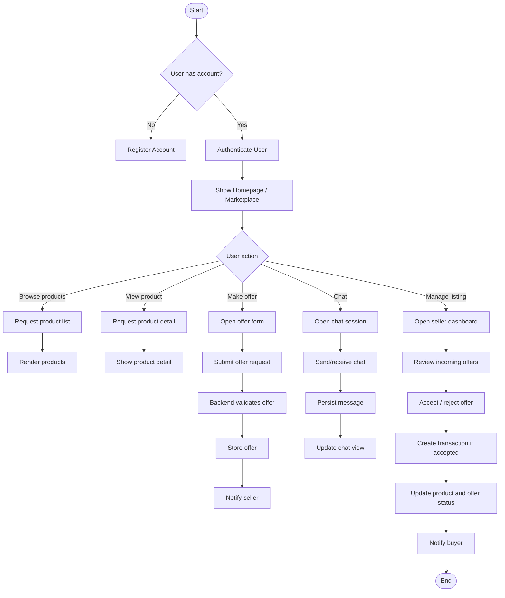
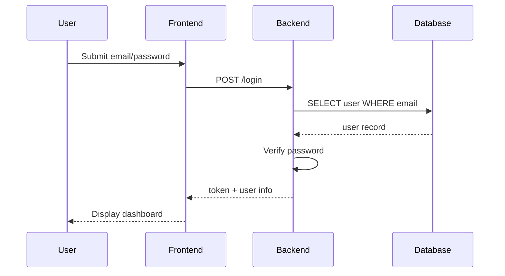
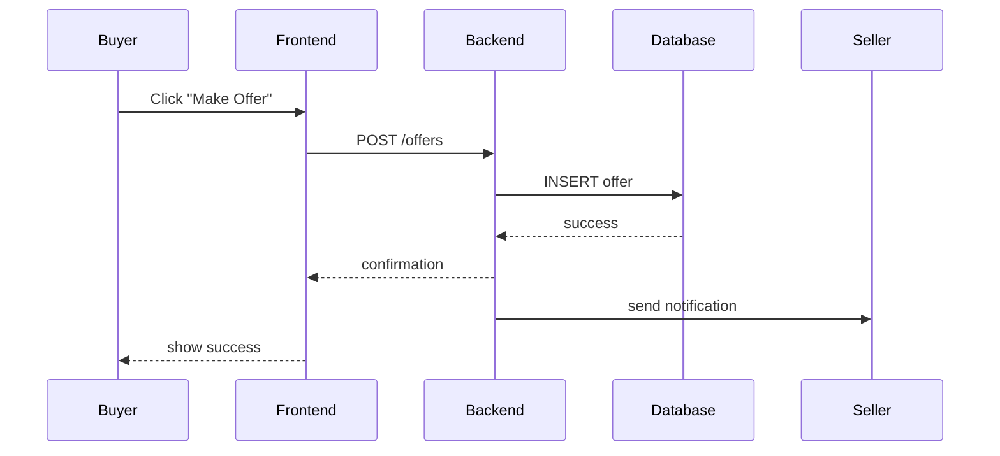
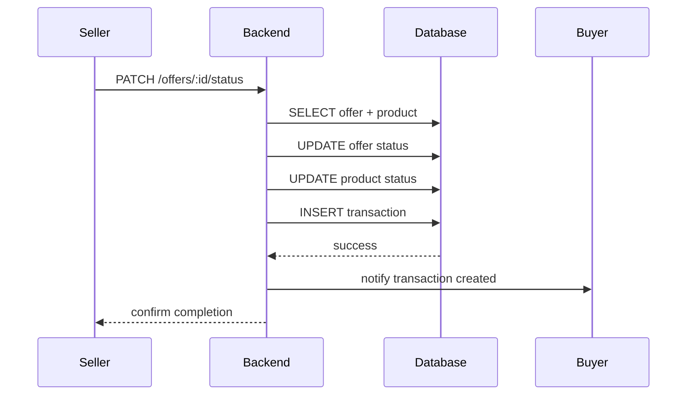
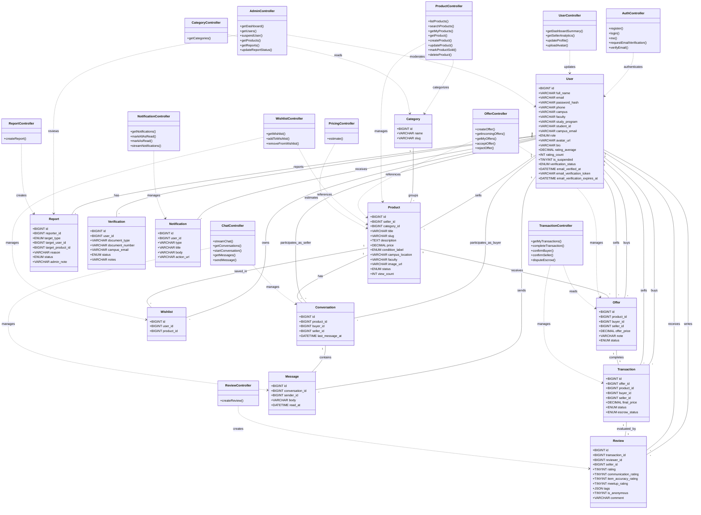

# C. UML Diagram

Dokumen ini menyajikan diagram UML untuk aplikasi BabePus: Use Case Diagram, Activity Diagram, Sequence Diagram, dan Class Diagram.

## 1. Use Case Diagram

```mermaid
graph TD

%% Actors
Guest[Guest]
Buyer[Buyer]
Seller[Seller]
Admin[Admin]

%% Guest Features
subgraph Guest_Features
    UC1((Register))
    UC2((Login))
    UC3((Browse Products))
    UC4((Search Products))
    UC5((View Product Detail))
    UC6((View Categories))
end

%% Buyer Features
subgraph Buyer_Features
    UC7((View Profile))
    UC8((Update Profile))
    UC9((Upload Avatar))
    UC10((Make Offer))
    UC11((View My Offers))
    UC12((Start Chat))
    UC13((View Conversations))
    UC14((Send Message))
    UC15((Add to Wishlist))
    UC16((Remove from Wishlist))
    UC17((Create Review))
    UC18((Create Report))
    UC19((Request Email Verification))
    UC20((Verify Email))
    UC21((View Notifications))
    UC22((Use Pricing Estimate))
end

%% Seller Features
subgraph Seller_Features
    UC23((Add Product))
    UC24((Update Product))
    UC25((Mark Product Sold))
    UC26((Delete Product))
    UC27((View My Products))
    UC28((View Incoming Offers))
    UC29((Accept Offer))
    UC30((Reject Offer))
    UC31((View Dashboard))
    UC32((View Seller Analytics))
end

%% Admin Features
subgraph Admin_Features
    UC33((View Admin Dashboard))
    UC34((Manage Users))
    UC35((Suspend User))
    UC36((View Products))
    UC37((View Reports))
    UC38((Update Report Status))
end

%% Actor Connections
Guest --> UC1
Guest --> UC2
Guest --> UC3
Guest --> UC4
Guest --> UC5
Guest --> UC6

Buyer --> UC7
Buyer --> UC8
Buyer --> UC9
Buyer --> UC10
Buyer --> UC11
Buyer --> UC12
Buyer --> UC13
Buyer --> UC14
Buyer --> UC15
Buyer --> UC16
Buyer --> UC17
Buyer --> UC18
Buyer --> UC19
Buyer --> UC20
Buyer --> UC21
Buyer --> UC22

Seller --> UC23
Seller --> UC24
Seller --> UC25
Seller --> UC26
Seller --> UC27
Seller --> UC28
Seller --> UC29
Seller --> UC30
Seller --> UC31
Seller --> UC32
Seller --> UC12
Seller --> UC13
Seller --> UC14

Admin --> UC33
Admin --> UC34
Admin --> UC35
Admin --> UC36
Admin --> UC37
Admin --> UC38

%% Login Dependencies
UC10 -. requires .-> UC2
UC23 -. requires .-> UC2
UC27 -. requires .-> UC2
UC28 -. requires .-> UC2
UC31 -. requires .-> UC2
UC33 -. requires .-> UC2
UC17 -. requires .-> UC2
UC18 -. requires .-> UC2
UC12 -. requires .-> UC2
UC14 -. requires .-> UC2
UC15 -. requires .-> UC2
```

## 2. Activity Diagram

## 3. Sequence Diagram

### 3.1 Login Sequence

### 3.2 Create Offer Sequence

### 3.3 Complete Transaction Sequence

## 4. Class Diagram

## 5. Keterangan

- Use Case Diagram menampilkan aktor utama: `User`, `Seller`, `Admin`.
- Activity Diagram menunjukkan alur autentikasi, pencarian produk, pembuatan penawaran, dan transaksi.
- Sequence Diagram mengilustrasikan interaksi frontend-backend-database untuk login, penawaran, dan penyelesaian transaksi.
- Class Diagram menampilkan entitas data utama dan relasi antar objek sesuai struktur database.
