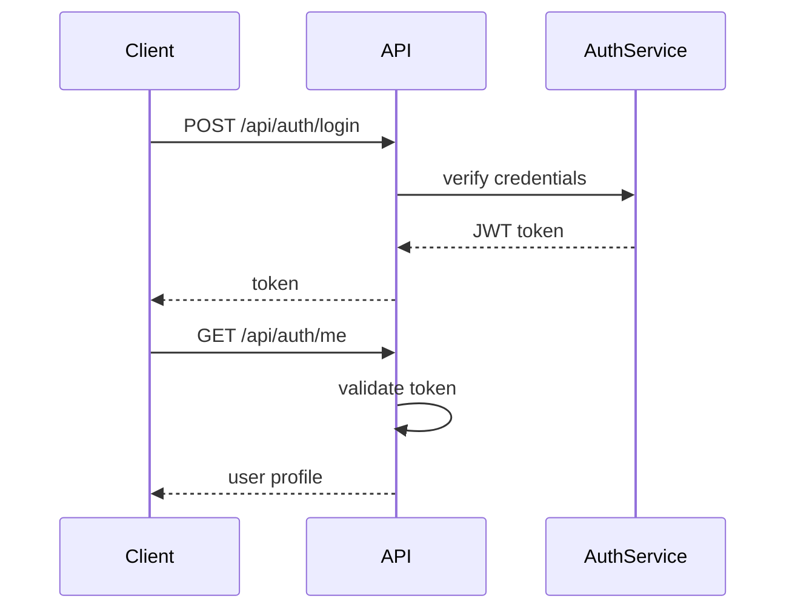

# E. API Design

Dokumen ini menjelaskan desain API BabePus, termasuk endpoint, request, response, dan alur autentikasi.

## 1. Konvensi Umum

- Base URL: `/api`
- Header autentikasi untuk endpoint terproteksi:
  - `Authorization: Bearer <token>`
- Format respon umum:
  - `success`: boolean
  - `message`: string (opsional)
  - `data`: object atau array
  - `meta`: object (opsional, untuk paginasi)

Contoh:
```json
{
  "success": true,
  "data": { ... }
}
```

## 2. Authentication Flow

1. Pengguna mendaftar dengan `POST /api/auth/register`.
2. Setelah pendaftaran, pengguna login dengan `POST /api/auth/login`.
3. Backend mengembalikan token JWT.
4. Semua permintaan ke endpoint terproteksi menyertakan header `Authorization`.
5. Backend memvalidasi token di middleware `authMiddleware` dan menambahkan `req.user`.
6. Endpoint `GET /api/auth/me` mengembalikan data profil user yang sedang login.

## 3. Endpoint API

### 3.1 Auth

#### `POST /api/auth/register`
- Request body:
  - `full_name` or `nama`
  - `email`
  - `password`
- Response:
  - `success`, `message`, `data` berisi user atau credential.

#### `POST /api/auth/login`
- Request body:
  - `email`
  - `password`
- Response:
  - `success`, `message`, `data` berisi token dan pengguna.

#### `GET /api/auth/me`
- Auth: required
- Response:
  - `success`, `data.user`

#### `POST /api/auth/email-verification/request`
- Auth: required
- Response:
  - `success`, `message`, `data.emailVerification`

#### `POST /api/auth/email-verification/verify`
- Request body:
  - `token`
- Response:
  - `success`, `message`, `data.user`

### 3.2 Users

#### `GET /api/users/dashboard`
- Auth: required
- Response:
  - `success`, `data` berisi ringkasan dashboard pengguna.

#### `GET /api/users/analytics`
- Auth: required
- Response:
  - `success`, `data.analytics`

#### `PUT /api/users/profile`
- Auth: required
- Request body:
  - `full_name`, `phone`, `campus`, `faculty`, `study_program`, `bio`, dll.
- Response:
  - `success`, `message`, `data.user`

#### `PATCH /api/users/avatar`
- Auth: required
- Request: multipart/form-data `avatar`
- Response:
  - `success`, `message`, `data.user`

### 3.3 Categories

#### `GET /api/categories`
- Auth: optional
- Response:
  - `success`, `data.categories`

### 3.4 Products

#### `GET /api/products`
- Auth: optional
- Query:
  - `page`, `limit`, `search`, `q`, `category`, `sort`
- Response:
  - `success`, `data.products`, `meta`

#### `GET /api/products/search`
- Auth: optional
- Query:
  - `search` atau `q`, `limit`, `page`
- Response:
  - `success`, `data.products`, `meta`

#### `GET /api/products/mine`
- Auth: required
- Response:
  - `success`, `data.products`

#### `GET /api/products/:id`
- Auth: optional
- Response:
  - `success`, `data.product`

#### `POST /api/products`
- Auth: required
- Request: multipart/form-data
  - `category_id`
  - `title` / `nama_barang`
  - `description` / `deskripsi`
  - `price` / `harga`
  - `condition` / `kondisi`
  - `image` file
- Response:
  - `success`, `message`, `data.product`

#### `PUT /api/products/:id`
- Auth: required
- Request: multipart/form-data
  - optional fields untuk update produk
- Response:
  - `success`, `message`, `data.product`

#### `PATCH /api/products/:id/sold`
- Auth: required
- Response:
  - `success`, `message`, `data.product`

#### `DELETE /api/products/:id`
- Auth: required
- Response:
  - `success`, `message`, `data.product`

### 3.5 Offers

#### `POST /api/offers`
- Auth: required
- Request body:
  - `product_id`
  - `offer_price` / `harga_tawaran`
- Response:
  - `success`, `message`, `data.offer`

#### `GET /api/offers/incoming`
- Auth: required
- Response:
  - `success`, `data.offers`

#### `GET /api/offers/my`
- Auth: required
- Response:
  - `success`, `data.offers`

#### `PATCH /api/offers/:id/accept`
- Auth: required
- Response:
  - `success`, `message`, `data`

#### `PATCH /api/offers/:id/reject`
- Auth: required
- Response:
  - `success`, `message`, `data.offer`

### 3.6 Transactions

#### `GET /api/transactions/my`
- Auth: required
- Response:
  - `success`, `data.transactions`

#### `PATCH /api/transactions/:id/complete`
- Auth: required
- Response:
  - `success`, `message`, `data.transaction`

#### `PATCH /api/transactions/:id/escrow/buyer-confirm`
- Auth: required
- Response:
  - `success`, `message`, `data.transaction`

#### `PATCH /api/transactions/:id/escrow/seller-confirm`
- Auth: required
- Response:
  - `success`, `message`, `data.transaction`

#### `PATCH /api/transactions/:id/escrow/dispute`
- Auth: required
- Request body:
  - `note`
- Response:
  - `success`, `message`, `data.transaction`

### 3.7 Reviews

#### `POST /api/reviews`
- Auth: required
- Request body:
  - `transaction_id`
  - `rating`
  - `comment`
  - optional `communication_rating`, `item_accuracy_rating`, `meetup_rating`, `tags`, `is_anonymous`
- Response:
  - `success`, `message`, `data.review`

### 3.8 Reports

#### `POST /api/reports`
- Auth: required
- Request body:
  - `target_type` (`product` atau `user`)
  - `target_user_id` (opsional)
  - `target_product_id` (opsional)
  - `reason`
  - `details`
- Response:
  - `success`, `message`, `data.report`

### 3.9 Wishlist

#### `GET /api/wishlist`
- Auth: required
- Response:
  - `success`, `data.products`

#### `POST /api/wishlist/:productId`
- Auth: required
- Response:
  - `success`, `message`, `data.wishlist`

#### `DELETE /api/wishlist/:productId`
- Auth: required
- Response:
  - `success`, `message`, `data.wishlist`

### 3.10 Notifications

#### `GET /api/notifications`
- Auth: required
- Response:
  - `success`, `data`

#### `PATCH /api/notifications/read-all`
- Auth: required
- Response:
  - `success`, `data`

#### `PATCH /api/notifications/:id/read`
- Auth: required
- Response:
  - `success`, `data.notification`

#### `GET /api/notifications/stream`
- Auth: optional
- Query:
  - `token`
- Response: Server-Sent Events stream dengan event `notification`.

### 3.11 Chat

#### `GET /api/chat/conversations`
- Auth: required
- Response:
  - `success`, `data.conversations`

#### `POST /api/chat/conversations`
- Auth: required
- Request body:
  - `product_id`
  - `buyer_id`
  - `seller_id`
- Response:
  - `success`, `message`, `data`

#### `GET /api/chat/conversations/:id/messages`
- Auth: required
- Response:
  - `success`, `data.messages`

#### `POST /api/chat/conversations/:id/messages`
- Auth: required
- Request body:
  - `message`
- Response:
  - `success`, `message`, `data.message`

#### `GET /api/chat/stream`
- Auth: optional
- Query:
  - `token`
- Response: Server-Sent Events stream dengan event `message`.

### 3.12 Pricing

#### `POST /api/pricing/estimate`
- Auth: required
- Request body:
  - `category`, `condition`, `age`, `price`, atau atribut barang lainnya sesuai validasi.
- Response:
  - `success`, `data.estimate`

### 3.13 Admin

#### `GET /api/admin/dashboard`
- Auth: required
- Role: admin
- Response:
  - `success`, `data.stats`

#### `GET /api/admin/users`
- Auth: required
- Role: admin
- Query: `page`, `limit`
- Response:
  - `success`, `data.users`

#### `PATCH /api/admin/users/:id/suspend`
- Auth: required
- Role: admin
- Request body:
  - `isSuspended`
- Response:
  - `success`, `message`, `data.user`

#### `GET /api/admin/products`
- Auth: required
- Role: admin
- Response:
  - `success`, `data.products`

#### `GET /api/admin/reports`
- Auth: required
- Role: admin
- Response:
  - `success`, `data.reports`

#### `PATCH /api/admin/reports/:id/status`
- Auth: required
- Role: admin
- Request body:
  - `status`
- Response:
  - `success`, `message`, `data.report`

## 4. Error Handling

Umumnya respon error:
```json
{
  "success": false,
  "message": "Deskripsi error",
  "errors": [ ... ]
}
```

## 5. Authentication Flow Diagram



Dokumen ini dapat digunakan sebagai panduan implementasi frontend dan pengujian API BabePus.
