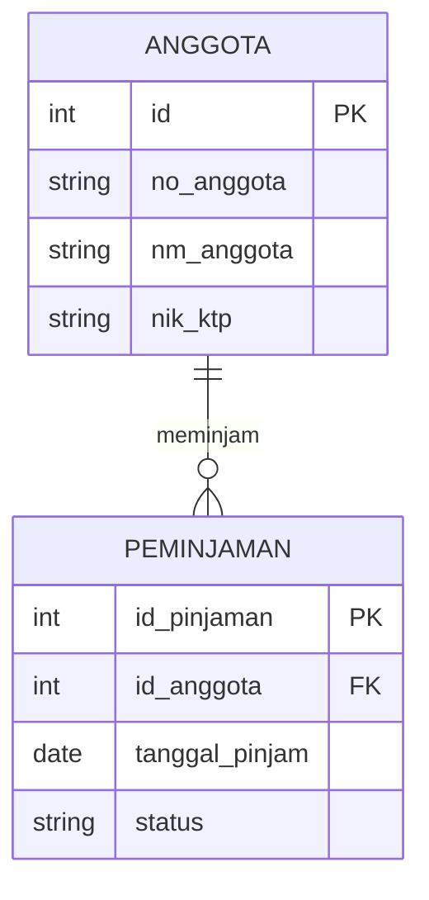

# Tabel Progress Pengerjaan Project

# White Box Testing
| No | Tugas | Status | Dikerjakan Oleh |
|----|--------|---------|-----------------|
| 1 | Model Desk Checking | Sudah Selesai | Raka |
| 2 | Model Code Walkthrough | sudah selesai | iki |
| 3 | Model Formal Inspection | sudah selesai |Raka  |
| 4 | Model Loop Testing | sudah selesai | iki|
| 5 | Model Control Flow Testing | Sudah Selesai | Raka |
| 6 | Model Data Flow Testing | sudah selesai | iki |
| 7 | Model Basic Path Testing | Sudah selesai | Raka |

---
# Black Box Testing
| No | Tugas | Status | Dikerjakan Oleh |
|----|--------|---------|-----------------|
| 1 | Boundary Value Analysis | Sudah Selesai | Raka |
| 2 | Equivalence Partitioning | belum Dikerjan |  |
| 3 | Comparison Testing | Sudah Dikerjakan | Raka |
| 4 | Decision Table Testing | Sudah Dikerjakan | Raka |
| 5 | Sample Testing | belum Selesai |  |
| 6 | Robustness Testing | selesai | Adit |
| 7 | Behaviour Testing | Belum Dikerjakan |  |
| 8 | Performance Testing | Belum Dikerjakan | |
| 9 | Endurance Testing | Belum Dikerjakan |  |

---

# Keterangan Status

| Status | Keterangan |
|---------|-------------|
| Belum Dikerjakan | Task belum dimulai |
| Sedang Dikerjakan | Task sedang dalam proses |
| Sudah Selesai | Task telah selesai dikerjakan | 

