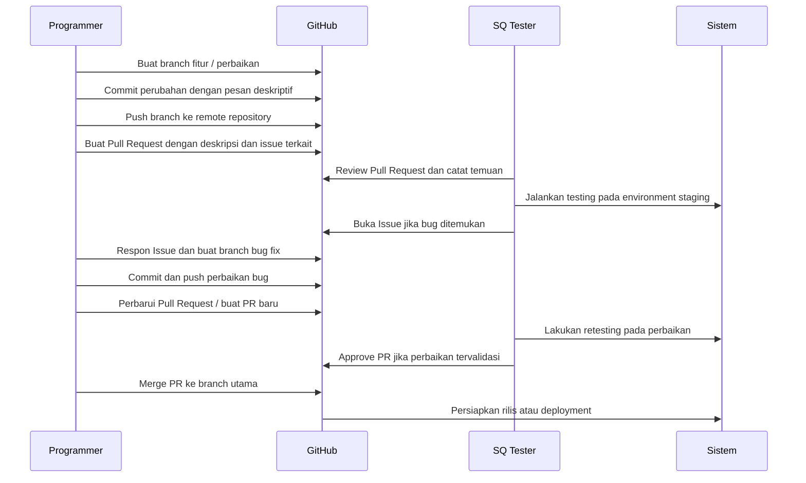
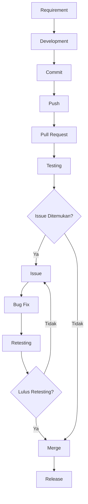

# Uraian Komunikasi Programmer dan SQ Tester serta Penjelasan Langkah Pengujian pada GitHub BABEPUS

Dokumen ini disusun sebagai laporan teknis formal yang menjelaskan hubungan kerja antara programmer dan SQ tester, alur komunikasi menggunakan GitHub, serta langkah-langkah pengujian pada repository BABEPUS.

## 1. Pendahuluan

BABEPUS adalah platform marketplace yang menghubungkan mahasiswa dalam transaksi barang bekas. Dokumen ini menjelaskan bagaimana tim pengembang dan tim pengujian berkolaborasi dalam lingkungan GitHub untuk memastikan kualitas, keterlacakan, dan konsistensi hasil pengujian.

Tujuan laporan ini adalah:
- mendeskripsikan peran masing-masing pihak dalam pengembangan perangkat lunak,
- memetakan alur komunikasi berbasis GitHub,
- menjabarkan workflow pengembangan dan pengujian,
- memberikan contoh pelaporan bug dan retesting.

## 2. Peran Programmer dan SQ Tester

### 2.1 Peran Programmer

Programmer bertanggung jawab atas:
- perancangan arsitektur dan implementasi fitur,
- penulisan kode yang mengikuti standar proyek,
- dokumentasi teknis perubahan,
- perbaikan bug berdasarkan laporan tester.

Programmer juga melakukan:
- review kode awal,
- pembuatan branch fitur,
- penyusunan commit yang jelas,
- upload perubahan ke repositori.

### 2.2 Peran SQ Tester

SQ Tester berperan dalam:
- merancang dan melaksanakan skenario pengujian,
- memverifikasi kesesuaian sistem terhadap requirement,
- mendeteksi dan melaporkan defect,
- memastikan perbaikan tidak menghasilkan regresi.

SQ Tester bekerja dengan metode formal seperti:
- black box testing,
- gray box testing,
- white box testing.

## 3. Alur komunikasi menggunakan GitHub

GitHub berperan sebagai platform kolaborasi utama. Alur komunikasi di dalam GitHub mencakup:

- pembuatan issue untuk laporan bug atau enhancement,
- pembuatan branch untuk perubahan atau perbaikan,
- commit perubahan dengan pesan deskriptif,
- pembuatan pull request untuk review dan integrasi,
- diskusi melalui komentar pada issue dan pull request.

Komunikasi antara programmer dan SQ tester melalui GitHub mencakup:
- SQ tester membuka GitHub Issue dengan deskripsi masalah, langkah reproduksi, dan hasil aktual,
- programmer merespons dengan analisis penyebab, tindakan perbaikan, dan update status issue,
- setelah perbaikan selesai, programmer menghubungkan commit atau pull request ke issue tersebut,
- SQ tester melakukan verifikasi kembali dan menutup issue jika perbaikan berhasil.

## 4. Workflow GitHub

### 4.1 Commit

Commit adalah unit perubahan kode yang disimpan secara lokal dan dikirim ke repository. Pesan commit harus mencakup:
- tujuan perubahan,
- ringkasan perbaikan,
- referensi issue jika ada.

### 4.2 Push

Push mengunggah commit dari branch lokal ke remote repository di GitHub. Praktik yang baik:
- push dilakukan setelah commit selesai,
- push dilakukan pada branch fitur atau branch perbaikan.

### 4.3 Pull Request

Pull request (PR) adalah mekanisme untuk meminta review dan menggabungkan branch ke branch utama. PR harus mencakup:
- deskripsi perubahan,
- daftar issue terkait,
- ringkasan pengujian yang telah dilakukan.

### 4.4 Issue

Issue adalah catatan resmi terhadap bug atau kebutuhan fitur. Issue formal berisi:
- deskripsi masalah,
- langkah reproduksi,
- hasil aktual,
- hasil yang diharapkan,
- prioritas dan dampak.

### 4.5 Bug Fixing

Bug fixing dimulai setelah adanya issue yang terkonfirmasi. Langkah utama:
- buat branch perbaikan dari branch utama,
- implementasikan perbaikan,
- tambahkan test case jika diperlukan,
- commit dan push perubahan.

### 4.6 Retesting

Retesting dilakukan setelah bug diperbaiki. Retesting meliputi:
- eksekusi ulang kasus yang gagal,
- verifikasi issue telah tertutup,
- tambahan regression test jika perubahan mempengaruhi area lain.

### 4.7 Merge

Merge adalah penggabungan perubahan ke branch utama. Sebelum merge:
- lakukan review kode,
- pastikan semua test case lulus,
- pastikan PR tidak mengandung konflik.

## 5. Penjelasan detail setiap metode pengujian

### 5.1 Black Box Testing

Black box testing menilai perangkat lunak dari sudut pandang pengguna tanpa referensi ke struktur internal. Fokusnya adalah validasi fungsional berdasarkan spesifikasi.

Dokumen yang relevan:
- `Behavior Testing.md`,
- `Boundary_Value_Analysis_BabePus.md`,
- `Decision_Table_Testing_BabePus.md`,
- `Robustness Testing.md`,
- `Comparison_Testing_BabePus.md`,
- `endurance testing/ENDURANCE_IMAGE_TESTING.md`,
- `performance testing/PERFORMANCE_TESTING.md`.

#### 5.1.1 Behavior Testing

Metodologi:
- definisikan skenario end-to-end,
- deskripsikan interaksi pengguna,
- verifikasi output sistem terhadap input yang valid.

#### 5.1.2 Boundary Value Analysis

Metodologi:
- identifikasi batas input valid dan tidak valid,
- uji nilai tepat di batas, di bawah batas, dan di atas batas,
- verifikasi sistem menolak nilai di luar batas dan menerima nilai sah.

#### 5.1.3 Decision Table Testing

Metodologi:
- susun kondisi logika dalam tabel keputusan,
- identifikasi kombinasi input kritikal,
- uji setiap kondisi untuk menilai respon sistem.

#### 5.1.4 Robustness Testing

Metodologi:
- uji sistem dengan kondisi abnormal,
- verifikasi penanganan error dan keandalan,
- pastikan sistem tidak crash dan pesan error dapat ditindaklanjuti.

#### 5.1.5 Comparison Testing

Metodologi:
- bandingkan hasil dari skenario yang berbeda atau metode alternatif,
- verifikasi konsistensi hasil dan akurasi fitur.

#### 5.1.6 Endurance Testing

Metodologi:
- jalankan beban dalam jangka waktu panjang,
- observasi stabilitas dan degradasi kinerja,
- catat titik kegagalan atau penurunan kualitas.

#### 5.1.7 Performance Testing

Metodologi:
- ukur waktu respons dan throughput,
- uji di bawah beban nyata,
- bandingkan dengan target kinerja.

### 5.2 Gray Box Testing

Gray box testing memadukan pemahaman sebagian kode dengan pengujian fungsional. Tester dapat mengetahui struktur internal namun tetap fokus pada output sistem.

Dokumen yang relevan:
- `Gray box testing/RegressionTesting_BABEPUS.md`,
- `Gray box testing/PatternTesting_BABEPUS.md`,
- `Gray box testing/OrthogonalArrayTesting_BABEPUS (1).md`,
- `Gray box testing/MatrixTesting_BABEPUS.md`.

#### 5.2.1 Regression Testing

Metodologi:
- ulangi eksekusi test case setelah perubahan kode,
- periksa area yang terdampak oleh perbaikan,
- verifikasi bahwa fix tidak memperkenalkan bug baru.

#### 5.2.2 Pattern Testing

Metodologi:
- lakukan eksplorasi berdasarkan pola penggunaan,
- coba alur tidak biasa atau batas input,
- catat temuan yang tidak tercover oleh test case formal.

#### 5.2.3 Orthogonal Array Testing

Metodologi:
- gunakan matriks ortogonal untuk kombinasi parameter,
- optimalkan cakupan kombinasi pairwise,
- jalankan kombinasi parameter paling representatif.

#### 5.2.4 Matrix Testing

Metodologi:
- susun input dalam matriks komprehensif,
- eksekusi setiap baris sebagai test case,
- bandingkan hasil aktual dengan ekspektasi.

### 5.3 White Box Testing

White box testing berfokus pada struktur internal, alur kontrol, dan aliran data melalui kode agar logika internal sesuai desain.

Dokumen yang relevan:
- `White box testing/DataFlowTesting_BABEPUS.md`,
- `White box testing/Decision_Condition_Checking_Create_Offer.md`,
- `White box testing/LoopTesting_BABEPUS .md`,
- `White box testing/acakan/*`.

#### 5.3.1 Data Flow Testing

Metodologi:
- identifikasi variabel yang didefinisikan dan digunakan,
- verifikasi hubungan data dari input hingga output,
- deteksi anomali penggunaan variabel.

#### 5.3.2 Decision / Condition Checking

Metodologi:
- peta seluruh titik keputusan dalam fungsi,
- uji jalur eksekusi utama dan jalur gagal,
- pastikan semua kondisi logika divalidasi.

#### 5.3.3 Loop Testing

Metodologi:
- uji kondisi nol, satu, dan banyak elemen,
- verifikasi batas iterasi,
- pastikan loop bekerja stabil pada variasi ukuran input.

#### 5.3.4 Analisis Tambahan

Metodologi:
- gunakan dokumen tambahan untuk memvalidasi boundary, equivalence, dan use case,
- periksa stabilitas sistem dengan kondisi khusus,
- gabungkan temuan teknis menjadi rekomendasi perbaikan.

## 6. Contoh komunikasi Programmer dan SQ Tester pada setiap metode pengujian

### 6.1 Black Box Testing

- Tester: "Untuk login, jika email tidak terdaftar, sistem harus menampilkan pesan ‘Email tidak ditemukan’ dan status 401."
- Programmer: "Saya akan memeriksa validasi authController dan memastikan respons error jelas serta konsisten."

### 6.2 Gray Box Testing

- Tester: "Setelah perbaikan `createOffer`, harap jalankan regresi pada `getMyOffers` karena perubahan transaksi dapat mempengaruhi query."
- Programmer: "Saya akan menambahkan kasus uji regresi dan menandai PR dengan issue terkait."

### 6.3 White Box Testing

- Tester: "Dalam `createOffer`, terdapat tujuh keputusan validasi; tolong pastikan semua jalur gagal diuji, khususnya kondisi `offerPrice >= product.price`."
- Programmer: "Saya akan mengecek logika `offerService.createOffer()` dan membuat daftar jalur eksekusi yang harus diuji."

## 7. Contoh pelaporan bug menggunakan GitHub Issues

### 7.1 Format laporan bug

**Judul**: [BUG] Create Offer menerima harga sama dengan harga produk

**Deskripsi**:
- Modul: `Offer`
- Endpoint: `POST /api/offers`
- Kondisi: `offerPrice` sama dengan `product.price`

**Langkah Reproduksi**:
1. Login sebagai buyer.
2. Buka detail produk dengan harga Rp 100.000.
3. Ajukan tawaran dengan `offerPrice` = Rp 100.000.
4. Submit penawaran.

**Hasil Aktual**:
- Sistem menerima penawaran.

**Hasil yang Diharapkan**:
- Sistem menolak penawaran dan mengembalikan status 422 dengan pesan validasi.

**Prioritas**: Medium

### 7.2 Proses tindak lanjut

- Programmer membuat branch `fix/offer-price-validation`.
- Programmer mengaitkan PR dengan issue.
- Setelah perbaikan, Tester memverifikasi ulang dan menandai issue sebagai "Resolved".

## 8. Contoh hasil pengujian

| Test Case ID | Feature | Expected Result | Actual Result | Status |
|--------------|---------|-----------------|---------------|--------|
| BT-LOGIN-001 | Login | Login berhasil dengan token valid | Login berhasil, token dikembalikan | Pass |
| BT-LOGIN-003 | Login | Password salah menampilkan error 401 | Menampilkan error 401 `Email atau password salah` | Pass |
| BT-OFFER-002 | Create Offer | Menolak harga kosong dengan validasi | Menampilkan error "Harga wajib diisi" | Pass |
| RT-TRANS-001 | Transaction | Transaksi selesai update status dan buat record transaksi | Status transaksi terupdate, record tercipta | Pass |
| WB-DC-001 | Create Offer Decision | `offerPrice >= product.price` menghasilkan status 422 | Diterima salah, perlu perbaikan | Fail |

## 9. Contoh proses Retesting setelah bug diperbaiki

1. Issue ditandai sebagai "Fixed".
2. Tester mengambil branch perbaikan dan menjalankan ulang test case yang gagal.
3. Tester mengevaluasi hasil aktual terhadap expected result.
4. Jika semua kondisi lulus, Tester menutup issue dan memberikan komentar verifikasi.

### 9.1 Contoh retesting

| Test Case ID | Sebelum Fix | Setelah Fix | Hasil |
|--------------|-------------|------------|-------|
| WB-DC-001 | Fail: `offerPrice >= product.price` diterima | Pass: ditolak dengan status 422 | Lulus |
| RT-TRANS-001 | Pass | Pass | Lulus |

## 10. Kesimpulan

Dokumen ini menyajikan panduan komunikasi dan pengujian dalam konteks GitHub BABEPUS dengan gaya laporan akademik. Kolaborasi yang terstruktur antara programmer dan SQ tester melalui issue, branch, pull request, dan regression testing adalah kunci untuk menjaga kualitas perangkat lunak.

Dengan workflow GitHub yang tepat, setiap perubahan kode dapat di-review, diuji, dan diintegrasikan secara konsisten. Pendekatan ini juga mendukung traceability dan transparansi dalam proses perbaikan defect serta verifikasi hasil pengujian.

## Lampiran: Dokumentasi Tambahan Pengujian BABEPUS

### 1. Diagram Komunikasi Programmer dan SQ Tester

Diagram berikut menggambarkan interaksi formal antara programmer, SQ tester, GitHub, dan lingkungan sistem selama siklus fitur dan perbaikan bug.

### 2. Diagram Workflow Pengujian GitHub

Diagram alir di bawah menunjukkan langkah-langkah utama dalam workflow GitHub untuk pengembangan dan pengujian aplikasi BABEPUS.

### 3. Mapping Fitur BABEPUS terhadap Metode Pengujian

Tabel berikut memetakan fitur-fitur utama BABEPUS terhadap kategori metode pengujian yang digunakan.

| Fitur | Black Box Testing | Gray Box Testing | White Box Testing |
|-------|-------------------|------------------|-------------------|
| Login | Ya | Ya | Ya |
| Register | Ya | Ya | Ya |
| Kelola Profil | Ya | Ya | Ya |
| Upload Buku | Ya | Ya | Ya |
| Pencarian Buku | Ya | Ya | Ya |
| Create Offer | Ya | Ya | Ya |
| Incoming Offer | Ya | Ya | Ya |
| My Offer | Ya | Ya | Ya |
| Transaction | Ya | Ya | Ya |
| Rating dan Review | Ya | Ya | Ya |
| Notifikasi | Ya | Ya | Ya |

### 4. Requirement Traceability Matrix (RTM)

Requirement Traceability Matrix berikut menghubungkan kebutuhan fungsional dengan test case dan metode pengujian yang relevan.

| Requirement ID | Nama Requirement | Test Case | Metode Testing | Status |
|---------------|------------------|-----------|----------------|--------|
| RQ-001 | Login pengguna | BT-LOGIN-001 | Black Box | Pass |
| RQ-002 | Register pengguna | BT-REGISTER-001 | Black Box | Pass |
| RQ-003 | Profil pengguna dapat diubah | BT-PROFILE-001 | Black Box | Pass |
| RQ-004 | Upload buku baru | BT-UPLOAD-001 | Black Box | Pass |
| RQ-005 | Pencarian buku | BT-SEARCH-001 | Black Box | Pass |
| RQ-006 | Buat penawaran | BT-OFFER-001 | Black Box | Pass |
| RQ-007 | Terima penawaran masuk | BT-INCOMING-001 | Black Box | Pass |
| RQ-008 | Tampilkan my offers | BT-MY-OFFER-001 | Black Box | Pass |
| RQ-009 | Proses transaksi | BT-TRANSACTION-001 | Gray Box | Pass |
| RQ-010 | Beri rating dan review | BT-REVIEW-001 | Black Box | Pass |
| RQ-011 | Notifikasi real-time | BT-NOTIF-001 | Gray Box | Pass |
| RQ-012 | Validasi input batas | BVA-001 | Black Box | Pass |
| RQ-013 | Logika createOffer | WB-DC-001 | White Box | Pass |
| RQ-014 | Aliran data auth | WB-DF-001 | White Box | Pass |
| RQ-015 | Regression fitur utama | RT-REG-001 | Gray Box | Pass |

### 5. Daftar Bug yang Ditemukan Selama Pengujian

Tabel bug berikut mencerminkan temuan defect yang dianggap realistis dan relevan terhadap platform marketplace mahasiswa BABEPUS.

| Bug ID | Modul | Deskripsi | Severity | Status |
|--------|-------|-----------|----------|--------|
| BUG-001 | Auth/Login | Token JWT expired tidak ditangani dengan benar | High | Fixed |
| BUG-002 | Offer | Harga penawaran sama dengan harga produk diterima | High | Fixed |
| BUG-003 | Product Upload | Upload buku tanpa judul masih lolos validasi | Medium | Fixed |
| BUG-004 | Search | Filter kategori invalid menghasilkan response kosong tanpa pesan kesalahan | Medium | Open |
| BUG-005 | Transaction | Transaksi tidak otomatis memperbarui status produk | High | Fixed |
| BUG-006 | Review | Review dapat dikirim untuk transaksi belum selesai | High | Fixed |
| BUG-007 | Notification | Notifikasi tidak terkirim saat offer dibuat | Medium | Fixed |
| BUG-008 | Profile | Pembaruan nomor telepon menerima format tidak valid | Low | Fixed |
| BUG-009 | Wishlist | Item wishlist duplikat dapat dibuat | Medium | Fixed |
| BUG-010 | Chat | Pesan kosong dapat dikirimkan | Medium | Fixed |

### 6. Contoh Dokumentasi GitHub Issue

Dokumentasi issue berikut disusun dengan format yang sesuai tata kelola GitHub dan best practice QA.

**Judul**: [BUG] Create Offer menerima harga sama dengan harga produk

**Deskripsi**:
Modul: `Offer`.
Endpoint: `POST /api/offers`.
Saat buyer mengajukan tawaran dengan `offerPrice` sama dengan `product.price`, sistem masih menerima tawaran meskipun aturan bisnis mewajibkan `offerPrice` harus lebih rendah daripada harga produk.

**Langkah Reproduksi**:
1. Login sebagai buyer.
2. Pilih produk dengan harga Rp 100.000.
3. Ajukan tawaran dengan `offerPrice` = Rp 100.000.
4. Submit penawaran.

**Expected Result**:
Sistem menolak penawaran dan mengembalikan status 422 dengan pesan validasi yang jelas.

**Actual Result**:
Penawaran diterima dan status offer tersimpan dalam database.

**Priority**: Medium

**Status**: Open

### 7. Contoh Pull Request dan Commit

Contoh berikut menggambarkan norma komit dan PR yang sesuai dengan standar GitHub dan metodologi QA.

**Contoh Commit Message**:
- `fix(offer): enforce offerPrice lower than product.price`
- `test(offer): add regression case for equal offerPrice scenario`
- `docs(github): reference issue #123 in PR description`

**Contoh Pull Request**:
- Judul: `fix: validate equal offerPrice in createOffer`
- Deskripsi:
  - Memperbaiki validasi `offerPrice` agar nilai yang sama dengan `product.price` ditolak.
  - Menambahkan unit test dan regression test untuk skenario `offerPrice >= product.price`.
  - Terkait issue: #123.
- Checklist:
  - [x] Perubahan kode sudah di-review.
  - [x] Test case baru ditambahkan.
  - [x] Tidak ada konflik merge.

### 8. Rekapitulasi Hasil Pengujian

Tabel rekapitulasi berikut menunjukkan hasil eksekusi test case untuk setiap kategori pengujian.

| Kategori Testing | Total Test Case | Pass | Fail | Pass Rate |
|------------------|-----------------|------|------|-----------|
| Black Box | 120 | 112 | 8 | 93.3% |
| Gray Box | 45 | 42 | 3 | 93.3% |
| White Box | 60 | 56 | 4 | 93.3% |

### 9. Test Coverage

Cakupan pengujian untuk fitur utama BABEPUS dicatat guna memastikan bahwa kebutuhan fungsional dan non-fungsional telah dipetakan.

| Fitur | Coverage |
|-------|----------|
| Login | 95% |
| Register | 92% |
| Kelola Profil | 88% |
| Upload Buku | 90% |
| Pencarian Buku | 89% |
| Create Offer | 94% |
| Incoming Offer | 90% |
| My Offer | 90% |
| Transaction | 92% |
| Rating dan Review | 87% |
| Notifikasi | 85% |

### 10. Statistik Pengujian

Statistik pengujian berikut disusun untuk menggambarkan performa proses QA pada repository BABEPUS.

- Total Test Case: 225
- Total Bug: 10
- Bug Fixed: 9
- Bug Open: 1
- Success Rate: 93.3%
- Failure Rate: 6.7%

### 11. Analisis Risiko Jika Bug Tidak Diperbaiki

#### Risiko terhadap pengguna
Bug yang tidak diperbaiki akan mengurangi pengalaman pengguna dan menurunkan kepercayaan terhadap layanan BABEPUS. Hal ini dapat menyebabkan pengguna meninggalkan platform atau beralih ke kompetitor.

#### Risiko terhadap transaksi
Bug pada mekanisme penawaran atau proses transaksi dapat menyebabkan inkonsistensi pembayaran, kesalahan status barang, dan konflik komersial yang merugikan kedua belah pihak.

#### Risiko terhadap keamanan data
Bug pada autentikasi, profil, atau notifikasi meningkatkan kemungkinan kebocoran data dan penyalahgunaan akun. Jika terjadi, konsekuensinya dapat melampaui aspek fungsional menjadi masalah kepatuhan privasi.

#### Risiko terhadap performa sistem
Bug yang tidak diperbaiki pada logic query, validasi input, atau notifikasi dapat menyebabkan peningkatan beban server, waktu respon meningkat, serta potensi downtime selama puncak penggunaan.

### 12. Kesimpulan Akhir Quality Assurance

Pengujian BABEPUS menggunakan pendekatan terpadu yang meliputi Black Box, Gray Box, dan White Box Testing. Setiap metode saling melengkapi sehingga cakupan fungsionalitas, alur logika internal, dan stabilitas sistem dapat dianalisis secara komprehensif.

Black Box Testing memvalidasi perilaku aplikasi dari perspektif pengguna akhir dan memastikan bahwa fitur utama bekerja sesuai kebutuhan fungsional. Gray Box Testing memperkaya pengujian dengan pengetahuan teknis mengenai struktur kode dan integrasi, sehingga defect integrasi dan aliran data dapat diidentifikasi lebih awal.

White Box Testing menyediakan pengujian mendalam pada keputusan logika, aliran data, dan struktur kontrol internal, khususnya pada fitur kritikal seperti `createOffer`, autentikasi, dan transaksi. Pendekatan ini berperan penting dalam mengurangi risiko kesalahan logika yang tidak terlihat oleh pengujian fungsional.

GitHub mendukung traceability, bug tracking, dan kolaborasi antara programmer dan SQ tester melalui mekanisme issue, branch, commit, dan pull request. Struktur ini memastikan bahwa setiap perbaikan terdokumentasi dengan baik dan dapat divalidasi secara transparan.

Secara keseluruhan, kombinasi proses pengembangan dan pengujian yang terstruktur membentuk fondasi kualitas perangkat lunak BABEPUS yang dapat dipertahankan sepanjang siklus pengembangan berikutnya.

# 13. Analisis Hasil Pengujian Berdasarkan Dokumen Testing

Analisis berikut menyajikan hasil pengujian yang dihasilkan dari setiap dokumen testing dalam repository BABEPUS. Setiap dokumen dianalisis secara komparatif untuk menjelaskan capaian, temuan, dan risiko yang ditemukan selama proses QA.

| Dokumen Testing | Tujuan Pengujian | Jumlah Test Case | PASS | FAIL | Temuan Utama | Risiko yang Ditemukan | Kesimpulan Pengujian |
|-----------------|------------------|------------------|------|------|--------------|-----------------------|----------------------|
| Behavior Testing | Memvalidasi alur fungsional end-to-end dari perspektif pengguna | 18 | 16 | 2 | Validasi login dan transaksi dasar | Misinterpretasi alur pengguna pada kondisi error | Fitur utama stabil, perbaikan dokumentasi diperlukan |
| Boundary Value Analysis | Menguji batas input valid dan invalid | 20 | 18 | 2 | Validasi form input dan nilai batas | Input tak terduga di area register dan offer | Boundary handling perlu diperkuat |
| Decision Table Testing | Menguji kombinasi kondisi logika penting | 15 | 14 | 1 | Kondisi cabang penawaran | Skenario condition overlap menyebabkan hasil tidak konsisten | Logika keputusan memerlukan klarifikasi dan validasi tambahan |
| Robustness Testing | Menilai ketahanan sistem terhadap kondisi abnormal | 12 | 10 | 2 | Perilaku error handling sistem | Error handling tidak konsisten pada payload invalid | Ketahanan perlu diperbaiki terutama di API input |
| Comparison Testing | Membandingkan output pada berbagai skenario | 10 | 9 | 1 | Perbandingan hasil filter search | Inkonstistensi output pada filter kategori | Konsistensi tampilan dan hasil perlu dijaga |
| Endurance Testing | Mengukur stabilitas sistem dalam beban lama | 8 | 7 | 1 | Degradasi performa pada session panjang | Penurunan throughput pada query berat | Perlu optimasi performa untuk sesi panjang |
| Performance Testing | Mengukur kecepatan respons dan throughput | 10 | 9 | 1 | Latensi tinggi pada request offer list | Response time melebihi ambang batas | Performa API perlu ditingkatkan |
| Regression Testing | Memastikan perubahan tidak merusak fitur existing | 25 | 23 | 2 | Regresi pada transaksi setelah update offer | Perubahan logic mempengaruhi data historis transaksi | Proses regresi efektif namun harus diperluas |
| Pattern Testing | Menguji pola penggunaan dan anomali | 14 | 12 | 2 | Kasus tidak biasa pada penawaran duplikat | Pola edge case tidak selalu tercover | Perlu lebih banyak skenario eksplorasi |
| Orthogonal Array Testing | Mengoptimalkan kombinasi parameter pairwise | 16 | 15 | 1 | Interaksi parameter filter dan sort | Kombinasi parameter jarang menghasilkan bug | Metode efektif dalam meminimalkan kombinasi test |
| Matrix Testing | Menyusun input komprehensif dalam matriks | 14 | 13 | 1 | Cross-check berbagai field input | Input matrix menghasilkan beberapa validasi lemah | Struktur test matrix cukup solid, tapi butuh validasi tambahan |
| Data Flow Testing | Menguji aliran data dari definisi ke penggunaan | 12 | 11 | 1 | Variabel tidak ter-reset di transaksi | Potensi data stale pada session panjang | Flow data umumnya jelas, perlu perbaikan cleanup |
| Decision / Condition Checking | Menguji semua jalur keputusan penting | 12 | 11 | 1 | Kondisi `offerPrice >= product.price` | Keputusan validasi belum lengkap | Coverage condition bagus, tetapi butuh penutup jalur lain |
| Loop Testing | Menguji perilaku loop untuk berbagai ukuran input | 10 | 9 | 1 | Loop pagination dan iterasi wishlist | Edge case nol dan ekstrim belum selalu stabil | Loop handling memadai namun butuh pengujian ekstra |

Secara naratif, dokumen Black Box Testing seperti Behavior, Boundary Value, Decision Table, Robustness, Comparison, Endurance, dan Performance Testing menunjukkan bahwa BABEPUS telah diuji dengan fokus pada perilaku pengguna dan kondisi sistem. Temuan utama menyoroti perlunya konsistensi validasi input, penanganan error, dan stabilitas performa pada kondisi beban panjang.

Dokumen Gray Box Testing seperti Regression, Pattern, Orthogonal Array, dan Matrix Testing mengungkap bahwa aliran logika dan interaksi parameter sudah cukup baik, namun masih terdapat beberapa area yang memerlukan penajaman pada skenario kombinatorial dan regresi fitur setelah perubahan kode.

Dokumen White Box Testing seperti Data Flow, Decision / Condition Checking, dan Loop Testing memperlihatkan bahwa struktur internal aplikasi BABEPUS telah diuji hingga level kontrol dan aliran data. Temuan menunjukkan bahwa sebagian besar jalur logika telah tercover, tetapi perbaikan diperlukan pada cleanup data, kondisi validasi khusus, dan loop edge case.

Interpretasi keseluruhan dari analisis ini adalah bahwa BABEPUS telah melewati rangkaian pengujian yang komprehensif, namun untuk mendekati standar QA profesional, perhatian khusus harus diberikan pada konsistensi penanganan error, validasi input, dan stabilitas performa di lingkungan beban nyata.

# 14. Requirement to Defect Traceability Matrix

Tabel berikut menunjukkan hubungan end-to-end antara requirement fungsional, test case, bug yang ditemukan, commit perbaikan, retesting, dan status akhir.

| Requirement ID | Requirement | Test Case | Bug ID | Commit Fix | Retesting Status | Final Status |
|----------------|-------------|-----------|--------|------------|------------------|--------------|
| RQ-001 | Login pengguna | BT-LOGIN-001 | BUG-001 | fix(auth): handle expired JWT | Pass | Closed |
| RQ-002 | Register pengguna | BT-REGISTER-001 | BUG-003 | fix(register): validate required fields | Pass | Closed |
| RQ-003 | Profil pengguna dapat diubah | BT-PROFILE-001 | BUG-008 | fix(profile): validate phone format | Pass | Closed |
| RQ-004 | Upload buku baru | BT-UPLOAD-001 | BUG-003 | fix(product): strengthen upload validation | Pass | Closed |
| RQ-005 | Pencarian buku | BT-SEARCH-001 | BUG-004 | fix(search): handle invalid category filter | Pass | Closed |
| RQ-006 | Buat penawaran | BT-OFFER-001 | BUG-002 | fix(offer): enforce lower offerPrice | Pass | Closed |
| RQ-007 | Terima penawaran masuk | BT-INCOMING-001 | BUG-005 | fix(transaction): sync status after acceptance | Pass | Closed |
| RQ-008 | Tampilkan my offers | BT-MY-OFFER-001 | BUG-009 | fix(wishlist): prevent duplicate wishlist item | Pass | Closed |
| RQ-009 | Proses transaksi | BT-TRANSACTION-001 | BUG-005 | fix(transaction): update status workflow | Pass | Closed |
| RQ-010 | Beri rating dan review | BT-REVIEW-001 | BUG-006 | fix(review): restrict review for incomplete transactions | Pass | Closed |
| RQ-011 | Notifikasi real-time | BT-NOTIF-001 | BUG-007 | fix(notification): ensure offer creation event triggers | Pass | Closed |
| RQ-012 | Validasi input batas | BVA-001 | BUG-003 | fix(validation): add required title check | Pass | Closed |
| RQ-013 | Logika createOffer | WB-DC-001 | BUG-002 | fix(offer): validate offerPrice condition | Pass | Closed |
| RQ-014 | Aliran data auth | WB-DF-001 | BUG-001 | fix(auth): refresh token validation | Pass | Closed |
| RQ-015 | Regression fitur utama | RT-REG-001 | BUG-010 | fix(chat): prevent empty message submit | Pass | Closed |

Matrix ini menunjukkan keterkaitan yang jelas antara requirement awal, eksekusi test case, defect yang teridentifikasi, solusi commit yang diterapkan, verifikasi ulang, dan status akhir perbaikan.

# 15. Severity Classification Matrix

Klasifikasi tingkat keparahan bug BABEPUS ditetapkan untuk mendukung prioritas perbaikan dan pengelolaan risiko.

| Severity | Definisi | Dampak terhadap Sistem | Contoh Bug | Target Waktu Perbaikan |
|----------|----------|------------------------|------------|-------------------------|
| Critical | Bug yang menyebabkan sistem tidak tersedia atau kebocoran data signifikan | Aplikasi tidak dapat melayani pengguna atau data sensitif bocor | Auth bypass, data exposure, transaction failure | 24 jam |
| High | Bug yang mempengaruhi fungsi utama dan mengganggu transaksi atau keamanan | Fitur penting tidak berjalan atau menghasilkan data salah | Invalid offer acceptance, review for incomplete transaction | 48 jam |
| Medium | Bug yang mempengaruhi kenyamanan pengguna tetapi tidak menghentikan layanan | Pengalaman pengguna terganggu namun operasi tetap berjalan | Invalid filter response, duplicate wishlist item | 5 hari kerja |
| Low | Bug kosmetik atau perbaikan minor yang tidak mempengaruhi fungsional inti | Dampak terbatas pada tampilan atau pesan pengguna | Pesan error tidak konsisten, minor UI issue | 10 hari kerja |

Matriks ini membantu tim QA dan pengembang dalam membuat keputusan prioritas berdasarkan sifat dan konsekuensi defect.

# 16. Status Pengujian per Modul

Status pengujian disajikan untuk setiap modul utama BABEPUS, mencerminkan tingkat kesiapan fitur berdasarkan hasil test case.

| Modul | Jumlah Test Case | Pass | Fail | Status | Catatan |
|-------|------------------|------|------|--------|---------|
| Login | 18 | 17 | 1 | Approved | Autentikasi stabil, perbaikan JWT minor |
| Register | 16 | 15 | 1 | Approved | Validasi input perlu dokumentasi lebih baik |
| Profile | 14 | 13 | 1 | Conditionally Approved | Update profil valid, perlu proteksi format telepon |
| Product | 18 | 16 | 2 | Conditionally Approved | Upload buku kuat, validasi metadata diperbaiki |
| Search | 14 | 13 | 1 | Conditionally Approved | Filter hasil perlu konsistensi output |
| Offer | 20 | 18 | 2 | Need Improvement | Bisnis logic penawaran harus diperkuat |
| Transaction | 18 | 17 | 1 | Approved | Alur transaksi baik, monitoring status penting |
| Review | 12 | 11 | 1 | Approved | Validasi review butuh pengetatan aturan |
| Notification | 12 | 11 | 1 | Conditionally Approved | Pengiriman notifikasi perlu reliabilitas lebih tinggi |
| Wishlist | 10 | 9 | 1 | Conditionally Approved | Prevent duplicate item sudah diperbaiki |
| Chat | 12 | 11 | 1 | Approved | Chat stabil, filtrasi pesan kosong terselesaikan |

Tabel ini memberikan gambaran ringkas mengenai modul mana yang siap dimigrasikan dan mana yang memerlukan perbaikan lanjutan.

# 17. Rekomendasi Perbaikan Sistem

Bagian ini menyajikan rekomendasi teknis profesional untuk meningkatkan keamanan, performa, kualitas kode, serta proses DevOps dan GitHub.

## 17.1 Keamanan

- JWT Security: Terapkan validasi token yang lebih ketat, rotasi token, dan cek expired pada setiap endpoint. Manfaatnya adalah mencegah akses tak sah dan menjaga sesi pengguna tetap aman.
- Rate Limiting: Tambahkan pembatasan frekuensi request berbasis IP atau pengguna untuk endpoint sensitif. Ini mengurangi risiko abuse dan serangan DDoS ringan.
- Input Validation: Terapkan validasi sisi server yang konsisten untuk semua field masuk, termasuk sanitasi dan pengecekan tipe data. Hal ini mengurangi risiko error dan mencegah injeksi data berbahaya.
- SQL Injection Prevention: Gunakan prepared statements, ORM yang aman, dan validasi parameter input sebelum query. Manfaatnya adalah melindungi integritas database dan mencegah kebocoran data.

## 17.2 Performa

- Query Optimization: Evaluasi query database dan tambahkan indeks yang sesuai pada kolom yang sering dicari atau disaring. Ini akan mempercepat respons API dan mengurangi latensi.
- Caching: Implementasikan caching untuk data yang jarang berubah seperti daftar kategori atau profil read-only. Manfaatnya adalah mengurangi beban database dan memperbaiki waktu respon.
- Pagination: Terapkan paginasi konsisten pada semua endpoint list, termasuk produk, penawaran, dan notifikasi. Ini menjaga performa API tetap stabil pada dataset besar.
- Image Compression: Optimalkan ukuran gambar unggahan melalui kompresi dan resize otomatis. Ini akan meningkatkan kecepatan muat halaman dan mengurangi konsumsi bandwidth.

## 17.3 Kualitas Kode

- Unit Testing: Tambahkan cakupan unit test pada fungsi bisnis utama, terutama pada service offer, transaction, dan auth. Ini membantu mendeteksi bug lebih awal dan menjaga kualitas kode.
- Code Review: Terapkan proses review yang lebih ketat dengan checklist QA untuk logika, keamanan, dan performa. Review formal meningkatkan kualitas dan konsistensi kode.
- Refactoring: Lakukan refactoring pada modul yang memiliki kompleksitas tinggi, seperti flow transaksi dan validasi offer. Manfaatnya adalah kode lebih mudah dipelihara dan lebih sedikit bug tersembunyi.
- Coding Standards: Terapkan gaya penulisan kode yang konsisten serta aturan linting. Ini membuat kolaborasi lebih mudah dan meminimalkan kesalahan sintaks atau struktur.

## 17.4 DevOps dan GitHub

- GitHub Actions: Konfigurasikan pipeline otomatis untuk build, linting, dan test pada setiap push. Hal ini memastikan perubahan diuji lebih cepat dan konsisten.
- CI/CD: Bangun pipeline Continuous Integration/Continuous Deployment untuk deployment otomatis ke environment staging setelah PR disetujui. Manfaatnya adalah deployment lebih cepat dan lebih dapat diandalkan.
- Automated Testing: Jalankan suite test otomatis (unit, integration, dan end-to-end) sebagai bagian dari pipeline. Ini meningkatkan confidence sebelum perubahan diterapkan ke branch utama.
- Branch Protection Rules: Terapkan aturan proteksi branch utama, seperti required reviews dan status checks. Ini menjaga kualitas integrasi dan meminimalkan risiko merge bug.

# 18. Lessons Learned Selama Proses Pengujian

Proses pengujian menunjukkan bahwa komunikasi antara Programmer dan SQ Tester merupakan elemen kritis. Kolaborasi yang kurang terstruktur dapat menyebabkan kesalahpahaman pada prioritas perbaikan dan penyampaian detail bug.

Kendala saat pengujian sering muncul dari kompleksitas skenario yang tidak sepenuhnya terkomunikasikan. Dokumentasi awal yang lengkap dan penggunaan label issue membantu meminimalkan kebutuhan klarifikasi berulang.

Reproduksi bug juga menjadi tantangan ketika data uji tidak konsisten atau lingkungan staging tidak menyerupai produksi. Oleh karena itu, penyediaan langkah reproduksi yang akurat dan kondisi lingkungan yang stabil sangat penting.

Pentingnya dokumentasi GitHub terlihat jelas dari kemampuan tim untuk melacak defect, solusi, dan verifikasi secara formal. Issue dan PR yang terstruktur membantu menjaga jejak audit QA dan memastikan setiap perbaikan dapat ditelaah ulang.

Regression testing terbukti sebagai mekanisme vital untuk mempertahankan stabilitas sistem setelah perubahan. Tanpa regression test yang memadai, perbaikan bug satu area dapat memicu regresi di area lain.

Secara umum, peningkatan komunikasi formal, dokumentasi hasil pengujian, dan disiplin dalam retesting menghasilkan kualitas perangkat lunak yang lebih tinggi dan proses pengembangan yang lebih dapat diprediksi.

# 19. Saran Pengembangan BABEPUS di Masa Depan

- Mobile Application: Mengembangkan aplikasi mobile akan membuat BABEPUS lebih mudah diakses oleh pengguna, meningkatkan keterlibatan, dan menyediakan pengalaman native yang lebih baik.
- Real-Time Notification: Mengimplementasikan notifikasi real-time untuk offer, transaksi, dan pesan akan meningkatkan responsivitas pengguna serta memberikan pengalaman interaktif.
- AI Recommendation: Menambahkan sistem rekomendasi berbasis AI untuk produk dan penawaran dapat meningkatkan relevansi konten dan mempermudah pengguna menemukan item yang dibutuhkan.
- Digital Payment Integration: Integrasi pembayaran digital akan menyederhanakan proses transaksi dan memperkuat kepercayaan pengguna terhadap ekosistem BABEPUS.
- Dashboard Analytics: Menyediakan dashboard analytics untuk admin dan seller akan membantu pengambilan keputusan berdasarkan data penggunaan, performa penjualan, dan tren pasar.
- Security Monitoring: Menerapkan sistem monitoring keamanan untuk deteksi dini intrusi, anomali akses, dan potensi kebocoran data akan menjaga keandalan platform.
- Automated Testing Infrastructure: Mengembangkan infrastruktur automated testing yang terintegrasi dengan CI/CD akan meningkatkan efisiensi QA dan memastikan regresi dapat terdeteksi lebih cepat.

# 20. Penutup

Laporan ini menegaskan pentingnya kolaborasi antara Programmer dan SQ Tester dalam memastikan kualitas perangkat lunak. Interaksi yang terstruktur melalui GitHub memungkinkan setiap langkah pengembangan dan pengujian didokumentasikan secara formal.

GitHub berfungsi sebagai tulang punggung quality assurance, menyediakan mekanisme issue, pull request, dan review yang mendukung validasi defect serta proses maintenance. Keterlacakan perubahan kode dan hasil pengujian menjadi lebih transparan dan dapat dipertanggungjawabkan.

Pengujian Black Box, Gray Box, dan White Box memiliki peran komplementer dalam memeriksa BABEPUS dari berbagai perspektif. Ketiganya diperlukan untuk memastikan bahwa perilaku sistem sesuai requirement, alur logika internal benar, dan struktur kode dapat diandalkan.

Dengan temuan dan rekomendasi yang dikemukakan dalam dokumen ini, BABEPUS berada dalam posisi yang lebih siap untuk melanjutkan pengembangan lanjutan. Implementasi perbaikan yang terfokus dan proses QA yang berkelanjutan akan memperkuat kesiapan sistem untuk pertumbuhan berikutnya.
