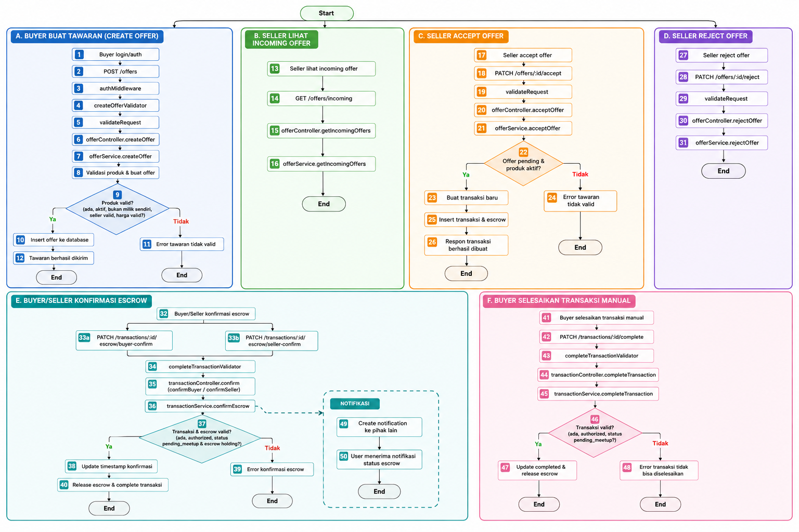

~~~mermaid
graph TD
  StartB((Start)) --> A1[1. Buyer login/auth]
  A1 --> A2[2. POST /offers]
  A2 --> A3[3. authMiddleware]
  A3 --> A4[4. createOfferValidator]
  A4 --> A5[5. validateRequest]
  A5 --> A6[6. offerController.createOffer]
  A6 --> A7[7. offerService.createOffer]
  A7 --> A8[8. Validasi produk & buat offer]
  A8 --> A9{9. Produk valid?}
  A9 -->|Ya| A10[10. Insert offer ke database]
  A9 -->|Tidak| A11[11. Error tawaran tidak valid]
  A10 --> A12[12. Tawaran berhasil dikirim]
  A11 --> End1((End))
  A12 --> End1

  StartB --> B1[13. Seller lihat incoming offer]
  B1 --> B2[14. GET /offers/incoming]
  B2 --> B3[15. offerController.getIncomingOffers]
  B3 --> B4[16. offerService.getIncomingOffers]
  B4 --> End2((End))

  StartB --> C1[17. Seller accept offer]
  C1 --> C2[18. PATCH /offers/:id/accept]
  C2 --> C3[19. validateRequest]
  C3 --> C4[20. offerController.acceptOffer]
  C4 --> C5[21. offerService.acceptOffer]
  C5 --> C6{22. Offer pending & produk aktif?}
  C6 -->|Ya| C7[23. Buat transaksi baru]
  C6 -->|Tidak| C8[24. Error tawaran tidak valid]
  C7 --> C9[25. Insert transaksi & escrow]
  C8 --> End3((End))
  C9 --> C10[26. Respon transaksi berhasil dibuat]
  C10 --> End3

  StartB --> D1[27. Seller reject offer]
  D1 --> D2[28. PATCH /offers/:id/reject]
  D2 --> D3[29. validateRequest]
  D3 --> D4[30. offerController.rejectOffer]
  D4 --> D5[31. offerService.rejectOffer]
  D5 --> End4((End))

  StartB --> E1[32. Buyer/Seller konfirmasi escrow]
  E1 --> E2[33. PATCH escrow confirm]
  E2 --> E3[34. completeTransactionValidator]
  E3 --> E4[35. transactionController.confirm]
  E4 --> E5[36. transactionService.confirmEscrow]
  E5 --> E6{37. Transaksi & escrow valid?}
  E6 -->|Ya| E7[38. Update timestamp konfirmasi]
  E6 -->|Tidak| E8[39. Error konfirmasi escrow]
  E7 --> E9[40. Release escrow & complete transaksi]
  E8 --> End5((End))
  E9 --> End5

  StartB --> F1[41. Buyer selesaikan transaksi]
  F1 --> F2[42. PATCH /transactions/:id/complete]
  F2 --> F3[43. completeTransactionValidator]
  F3 --> F4[44. transactionController.completeTransaction]
  F4 --> F5[45. transactionService.completeTransaction]
  F5 --> F6{46. Transaksi valid?}
  F6 -->|Ya| F7[47. Update completed & release escrow]
  F6 -->|Tidak| F8[48. Error transaksi]
  F7 --> End6((End))
  F8 --> End6

  E5 --> G1[49. Create notification]
  G1 --> G2[50. User menerima notifikasi]
  G2 --> End7((End))
~~~

# Basic Path Testing – Flow Pemesanan Barang

---

# A. Create Offer

| No | Process |
|----|----------|
| 1 | Buyer login/auth |
| 2 | POST /offers |
| 3 | authMiddleware |
| 4 | createOfferValidator |
| 5 | validateRequest |
| 6 | offerController.createOffer |
| 7 | offerService.createOffer |
| 8 | Validasi produk & buat offer |
| 9 | Cek produk valid |
| 10 | Insert offer ke database |
| 11 | Response success |
| 12 | End |

### Basic Path
```text
1 → 2 → 3 → 4 → 5 → 6 → 7 → 8 → 9(Ya) → 10 → 11 → 12
```

---

## Alternate/Error Path – Create Offer

| No | Process |
|----|----------|
| 1 | Buyer login/auth |
| 2 | POST /offers |
| 3 | authMiddleware |
| 4 | createOfferValidator |
| 5 | validateRequest |
| 6 | offerController.createOffer |
| 7 | offerService.createOffer |
| 8 | Validasi produk & buat offer |
| 9 | Cek produk valid |
| 10 | Error: tawaran tidak valid |
| 11 | End |

### Alternate Path
```text
1 → 2 → 3 → 4 → 5 → 6 → 7 → 8 → 9(Tidak) → 10 → 11
```

---

# B. Get Incoming Offers

| No | Process |
|----|----------|
| 13 | Seller lihat incoming offer |
| 14 | GET /offers/incoming |
| 15 | offerController.getIncomingOffers |
| 16 | offerService.getIncomingOffers |
| 17 | Response daftar offer |
| 18 | End |

### Basic Path
```text
13 → 14 → 15 → 16 → 17 → 18
```

---

# C. Accept Offer

| No | Process |
|----|----------|
| 19 | Seller accept offer |
| 20 | PATCH /offers/:id/accept |
| 21 | validateRequest |
| 22 | offerController.acceptOffer |
| 23 | offerService.acceptOffer |
| 24 | Cek offer pending & produk aktif |
| 25 | Buat transaksi baru |
| 26 | Insert transaksi & escrow |
| 27 | Response transaksi berhasil dibuat |
| 28 | End |

### Basic Path
```text
19 → 20 → 21 → 22 → 23 → 24(Ya) → 25 → 26 → 27 → 28
```

---

## Alternate/Error Path – Accept Offer

| No | Process |
|----|----------|
| 19 | Seller accept offer |
| 20 | PATCH /offers/:id/accept |
| 21 | validateRequest |
| 22 | offerController.acceptOffer |
| 23 | offerService.acceptOffer |
| 24 | Cek offer pending & produk aktif |
| 25 | Error: tawaran tidak bisa diproses |
| 26 | End |

### Alternate Path
```text
19 → 20 → 21 → 22 → 23 → 24(Tidak) → 25 → 26
```

---

# D. Reject Offer

| No | Process |
|----|----------|
| 29 | Seller reject offer |
| 30 | PATCH /offers/:id/reject |
| 31 | validateRequest |
| 32 | offerController.rejectOffer |
| 33 | offerService.rejectOffer |
| 34 | Response offer rejected |
| 35 | End |

### Basic Path
```text
29 → 30 → 31 → 32 → 33 → 34 → 35
```

---

# E. Confirm Escrow

| No | Process |
|----|----------|
| 36 | Buyer/Seller konfirmasi escrow |
| 37 | PATCH escrow confirm |
| 38 | completeTransactionValidator |
| 39 | transactionController.confirm |
| 40 | transactionService.confirmEscrow |
| 41 | Cek transaksi & escrow valid |
| 42 | Update timestamp konfirmasi |
| 43 | Release escrow & complete transaksi |
| 44 | End |

### Basic Path
```text
36 → 37 → 38 → 39 → 40 → 41(Ya) → 42 → 43 → 44
```

---

## Alternate/Error Path – Confirm Escrow

| No | Process |
|----|----------|
| 36 | Buyer/Seller konfirmasi escrow |
| 37 | PATCH escrow confirm |
| 38 | completeTransactionValidator |
| 39 | transactionController.confirm |
| 40 | transactionService.confirmEscrow |
| 41 | Cek transaksi & escrow valid |
| 42 | Error: konfirmasi escrow tidak valid |
| 43 | End |

### Alternate Path
```text
36 → 37 → 38 → 39 → 40 → 41(Tidak) → 42 → 43
```

---

# F. Complete Transaction Manual

| No | Process |
|----|----------|
| 45 | Buyer selesaikan transaksi manual |
| 46 | PATCH /transactions/:id/complete |
| 47 | completeTransactionValidator |
| 48 | transactionController.completeTransaction |
| 49 | transactionService.completeTransaction |
| 50 | Cek transaksi valid |
| 51 | Update completed & release escrow |
| 52 | End |

### Basic Path
```text
45 → 46 → 47 → 48 → 49 → 50(Ya) → 51 → 52
```

---

## Alternate/Error Path – Complete Transaction Manual

| No | Process |
|----|----------|
| 45 | Buyer selesaikan transaksi manual |
| 46 | PATCH /transactions/:id/complete |
| 47 | completeTransactionValidator |
| 48 | transactionController.completeTransaction |
| 49 | transactionService.completeTransaction |
| 50 | Cek transaksi valid |
| 51 | Error: transaksi tidak bisa diselesaikan |
| 52 | End |

### Alternate Path
```text
45 → 46 → 47 → 48 → 49 → 50(Tidak) → 51 → 52
```

---

# G. Notification Escrow

| No | Process |
|----|----------|
| 53 | Create notification |
| 54 | User menerima notifikasi status escrow |
| 55 | End |

### Basic Path
```text
53 → 54 → 55
```
# Graph Matrix Testing – Flow Pemesanan Barang

| Edge | From | To | Keterangan |
|------|------|----|-------------|
| E1 | 1 | 2 | Buyer login → POST offer |
| E2 | 2 | 3 | Request masuk middleware |
| E3 | 3 | 4 | Validasi auth berhasil |
| E4 | 4 | 5 | Validasi request |
| E5 | 5 | 6 | Controller createOffer |
| E6 | 6 | 7 | Service createOffer |
| E7 | 7 | 8 | Validasi produk |
| E8 | 8 | 9 | Decision produk valid |
| E9 | 9 | 10 | Jalur valid |
| E10 | 9 | 11 | Jalur error |
| E11 | 10 | 12 | Success response |
| E12 | 11 | 12 | Error end |

---

# Matrix A – Create Offer

| Node | 1 | 2 | 3 | 4 | 5 | 6 | 7 | 8 | 9 | 10 | 11 | 12 |
|------|---|---|---|---|---|---|---|---|---|----|----|----|
| 1 | 0 | 1 | 0 | 0 | 0 | 0 | 0 | 0 | 0 | 0 | 0 | 0 |
| 2 | 0 | 0 | 1 | 0 | 0 | 0 | 0 | 0 | 0 | 0 | 0 | 0 |
| 3 | 0 | 0 | 0 | 1 | 0 | 0 | 0 | 0 | 0 | 0 | 0 | 0 |
| 4 | 0 | 0 | 0 | 0 | 1 | 0 | 0 | 0 | 0 | 0 | 0 | 0 |
| 5 | 0 | 0 | 0 | 0 | 0 | 1 | 0 | 0 | 0 | 0 | 0 | 0 |
| 6 | 0 | 0 | 0 | 0 | 0 | 0 | 1 | 0 | 0 | 0 | 0 | 0 |
| 7 | 0 | 0 | 0 | 0 | 0 | 0 | 0 | 1 | 0 | 0 | 0 | 0 |
| 8 | 0 | 0 | 0 | 0 | 0 | 0 | 0 | 0 | 1 | 0 | 0 | 0 |
| 9 | 0 | 0 | 0 | 0 | 0 | 0 | 0 | 0 | 0 | 1 | 1 | 0 |
| 10 | 0 | 0 | 0 | 0 | 0 | 0 | 0 | 0 | 0 | 0 | 0 | 1 |
| 11 | 0 | 0 | 0 | 0 | 0 | 0 | 0 | 0 | 0 | 0 | 0 | 1 |
| 12 | 0 | 0 | 0 | 0 | 0 | 0 | 0 | 0 | 0 | 0 | 0 | 0 |

---

# Matrix B – Incoming Offers

| Node | 13 | 14 | 15 | 16 | 17 | 18 |
|------|----|----|----|----|----|----|
| 13 | 0 | 1 | 0 | 0 | 0 | 0 |
| 14 | 0 | 0 | 1 | 0 | 0 | 0 |
| 15 | 0 | 0 | 0 | 1 | 0 | 0 |
| 16 | 0 | 0 | 0 | 0 | 1 | 0 |
| 17 | 0 | 0 | 0 | 0 | 0 | 1 |
| 18 | 0 | 0 | 0 | 0 | 0 | 0 |

---

# Matrix C – Accept Offer

| Node | 19 | 20 | 21 | 22 | 23 | 24 | 25 | 26 | 27 | 28 |
|------|----|----|----|----|----|----|----|----|----|----|
| 19 | 0 | 1 | 0 | 0 | 0 | 0 | 0 | 0 | 0 | 0 |
| 20 | 0 | 0 | 1 | 0 | 0 | 0 | 0 | 0 | 0 | 0 |
| 21 | 0 | 0 | 0 | 1 | 0 | 0 | 0 | 0 | 0 | 0 |
| 22 | 0 | 0 | 0 | 0 | 1 | 0 | 0 | 0 | 0 | 0 |
| 23 | 0 | 0 | 0 | 0 | 0 | 1 | 0 | 0 | 0 | 0 |
| 24 | 0 | 0 | 0 | 0 | 0 | 0 | 1 | 1 | 0 | 0 |
| 25 | 0 | 0 | 0 | 0 | 0 | 0 | 0 | 0 | 1 | 0 |
| 26 | 0 | 0 | 0 | 0 | 0 | 0 | 0 | 0 | 0 | 1 |
| 27 | 0 | 0 | 0 | 0 | 0 | 0 | 0 | 0 | 0 | 1 |
| 28 | 0 | 0 | 0 | 0 | 0 | 0 | 0 | 0 | 0 | 0 |

---

# Matrix D – Reject Offer

| Node | 29 | 30 | 31 | 32 | 33 | 34 | 35 |
|------|----|----|----|----|----|----|----|
| 29 | 0 | 1 | 0 | 0 | 0 | 0 | 0 |
| 30 | 0 | 0 | 1 | 0 | 0 | 0 | 0 |
| 31 | 0 | 0 | 0 | 1 | 0 | 0 | 0 |
| 32 | 0 | 0 | 0 | 0 | 1 | 0 | 0 |
| 33 | 0 | 0 | 0 | 0 | 0 | 1 | 0 |
| 34 | 0 | 0 | 0 | 0 | 0 | 0 | 1 |
| 35 | 0 | 0 | 0 | 0 | 0 | 0 | 0 |

---

# Matrix E – Confirm Escrow

| Node | 36 | 37 | 38 | 39 | 40 | 41 | 42 | 43 | 44 |
|------|----|----|----|----|----|----|----|----|----|
| 36 | 0 | 1 | 0 | 0 | 0 | 0 | 0 | 0 | 0 |
| 37 | 0 | 0 | 1 | 0 | 0 | 0 | 0 | 0 | 0 |
| 38 | 0 | 0 | 0 | 1 | 0 | 0 | 0 | 0 | 0 |
| 39 | 0 | 0 | 0 | 0 | 1 | 0 | 0 | 0 | 0 |
| 40 | 0 | 0 | 0 | 0 | 0 | 1 | 0 | 0 | 0 |
| 41 | 0 | 0 | 0 | 0 | 0 | 0 | 1 | 1 | 0 |
| 42 | 0 | 0 | 0 | 0 | 0 | 0 | 0 | 0 | 1 |
| 43 | 0 | 0 | 0 | 0 | 0 | 0 | 0 | 0 | 1 |
| 44 | 0 | 0 | 0 | 0 | 0 | 0 | 0 | 0 | 0 |

---

# Matrix F – Complete Transaction Manual

| Node | 45 | 46 | 47 | 48 | 49 | 50 | 51 | 52 |
|------|----|----|----|----|----|----|----|----|
| 45 | 0 | 1 | 0 | 0 | 0 | 0 | 0 | 0 |
| 46 | 0 | 0 | 1 | 0 | 0 | 0 | 0 | 0 |
| 47 | 0 | 0 | 0 | 1 | 0 | 0 | 0 | 0 |
| 48 | 0 | 0 | 0 | 0 | 1 | 0 | 0 | 0 |
| 49 | 0 | 0 | 0 | 0 | 0 | 1 | 0 | 0 |
| 50 | 0 | 0 | 0 | 0 | 0 | 0 | 1 | 1 |
| 51 | 0 | 0 | 0 | 0 | 0 | 0 | 0 | 1 |
| 52 | 0 | 0 | 0 | 0 | 0 | 0 | 0 | 0 |

---

# Matrix G – Notification

| Node | 53 | 54 | 55 |
|------|----|----|----|
| 53 | 0 | 1 | 0 |
| 54 | 0 | 0 | 1 |
| 55 | 0 | 0 | 0 |
