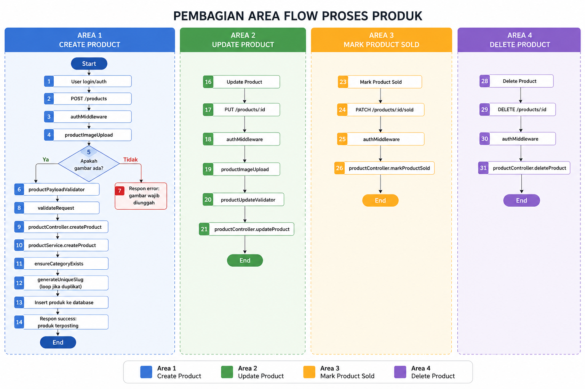

~~~ mermaid
graph TD
  0((Start)) --> 1[1. User login/auth]
  1 --> 2[2. POST /products]
  2 --> 3[3. authMiddleware]
  3 --> 4[4. productImageUpload]
  4 --> 5{5. Apakah gambar ada?}

  5 -->|Ya| 6[6. productPayloadValidator]
  5 -->|Tidak| 7[7. Error: gambar wajib diunggah]

  6 --> 8[8. validateRequest]
  8 --> 9[9. productController.createProduct]
  9 --> 10[10. productService.createProduct]
  10 --> 11[11. ensureCategoryExists]
  11 --> 12[12. generateUniqueSlug]
  12 --> 13[13. Insert produk ke database]
  13 --> 14[14. Respon success]
  14 --> 15((End))

  0 --> 16[16. Update Product]
  16 --> 17[17. PUT /products/:id]
  17 --> 18[18. authMiddleware]
  18 --> 19[19. productImageUpload]
  19 --> 20[20. productUpdateValidator]
  20 --> 21[21. productController.updateProduct]
  21 --> 22((End))

  0 --> 23[23. Mark Product Sold]
  23 --> 24[24. PATCH /products/:id/sold]
  24 --> 25[25. authMiddleware]
  25 --> 26[26. productController.markProductSold]
  26 --> 27((End))

  0 --> 28[28. Delete Product]
  28 --> 29[29. DELETE /products/:id]
  29 --> 30[30. authMiddleware]
  30 --> 31[31. productController.deleteProduct]
  31 --> 32((End))
~~~

