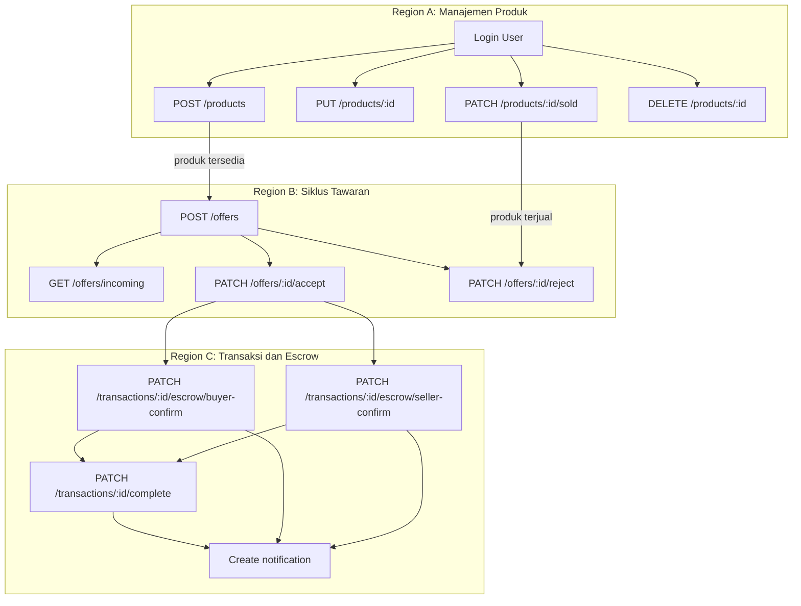

# Basic Path Testing - Pemostingan dan Pemesanan Barang

Dokumen ini menyajikan basic path testing berdasarkan diagram alur pemostingan barang dan pemesanan barang yang sudah ada.

## 1. Posting Produk Baru
- Kondisi awal: User sudah login/auth berhasil.
- Aksi: POST /products.
- Validasi: authMiddleware, productImageUpload, productPayloadValidator, validateRequest.
- Eksekusi: productController.createProduct → productService.createProduct → insert produk ke database.
- Hasil yang diharapkan: respon sukses, produk tercatat dan terposting.

## 2. Edit Produk
- Kondisi awal: User sudah login/auth berhasil.
- Aksi: PUT /products/:id.
- Validasi: authMiddleware, productImageUpload, productUpdateValidator.
- Eksekusi: productController.updateProduct.
- Hasil yang diharapkan: respon sukses, data produk terupdate.

## 3. Tandai Produk Terjual
- Kondisi awal: User sudah login/auth berhasil.
- Aksi: PATCH /products/:id/sold.
- Validasi: authMiddleware.
- Eksekusi: productController.markProductSold.
- Hasil yang diharapkan: status produk berubah menjadi terjual.

## 4. Hapus Produk
- Kondisi awal: User sudah login/auth berhasil.
- Aksi: DELETE /products/:id.
- Validasi: authMiddleware.
- Eksekusi: productController.deleteProduct.
- Hasil yang diharapkan: produk dihapus dari database.

## 5. Buat Tawaran Harga
- Kondisi awal: Buyer sudah login/auth berhasil.
- Aksi: POST /offers.
- Validasi: authMiddleware, createOfferValidator, validateRequest.
- Eksekusi: offerController.createOffer → offerService.createOffer → insert offer ke database.
- Hasil yang diharapkan: tawaran berhasil dikirim.

## 6. Lihat Tawaran Masuk
- Kondisi awal: Seller sudah login/auth berhasil.
- Aksi: GET /offers/incoming.
- Eksekusi: offerController.getIncomingOffers → offerService.getIncomingOffers.
- Hasil yang diharapkan: daftar tawaran masuk muncul.

## 7. Terima Tawaran dan Buat Transaksi
- Kondisi awal: Seller sudah login/auth berhasil.
- Aksi: PATCH /offers/:id/accept.
- Validasi: idParam + validateRequest.
- Eksekusi: offerController.acceptOffer → offerService.acceptOffer → buat transaksi baru dari offer → insert transactions & escrow data.
- Hasil yang diharapkan: transaksi dibuat otomatis dan escrow siap.

## 8. Tolak Tawaran
- Kondisi awal: Seller sudah login/auth berhasil.
- Aksi: PATCH /offers/:id/reject.
- Validasi: idParam + validateRequest.
- Eksekusi: offerController.rejectOffer → offerService.rejectOffer.
- Hasil yang diharapkan: tawaran ditolak dan status update.

## 9. Konfirmasi Escrow
- Kondisi awal: Buyer atau Seller sudah login/auth berhasil.
- Aksi: PATCH /transactions/:id/escrow/buyer-confirm atau PATCH /transactions/:id/escrow/seller-confirm.
- Validasi: completeTransactionValidator.
- Eksekusi: transactionController.confirmBuyer / confirmSeller → transactionService.confirmEscrow → update timestamp konfirmasi.
- Hasil yang diharapkan: jika kedua pihak konfirmasi, status transaksi berubah completed dan escrow dirilis.

## 10. Selesaikan Transaksi Manual
- Kondisi awal: Buyer sudah login/auth berhasil.
- Aksi: PATCH /transactions/:id/complete.
- Validasi: completeTransactionValidator.
- Eksekusi: transactionController.completeTransaction → transactionService.completeTransaction → update status completed, release escrow.
- Hasil yang diharapkan: transaksi selesai manual dan escrow dicairkan.

## 11. Notifikasi Status Escrow
- Kondisi awal: proses transaksi / konfirmasi escrow terjadi.
- Aksi: pembuatan notifikasi internal.
- Eksekusi: create notification ke pihak lain.
- Hasil yang diharapkan: user menerima notifikasi status escrow.

> Catatan: basic path testing di atas hanya mencakup jalur utama yang valid. Jalur error, input tidak valid, dan kondisi alternatif belum termasuk.

## 12. Flow Graph

## 13. Region dan Struktur Pola

### Region
- Region A: Manajemen Produk
  - Memuat proses posting produk, edit produk, mark sold, dan delete produk.
  - Pola: validasi auth -> upload / payload -> controller -> service -> database.

- Region B: Siklus Tawaran
  - Memuat proses pembuatan tawaran, melihat tawaran masuk, menerima atau menolak tawaran.
  - Pola: validasi request -> controller tawaran -> service tawaran -> update status atau buat transaksi.

- Region C: Transaksi dan Escrow
  - Memuat proses konfirmasi escrow buyer/seller, penyelesaian transaksi manual, dan notifikasi.
  - Pola: validator konfirmasi -> controller transaksi -> service transaksi -> update status / release escrow -> notifikasi.

### Struktur Pola
- Pola umum: layer berurutan
  1. Auth/Identitas
  2. Validasi data
  3. Controller
  4. Service
  5. Database / output

- Pola alur: branch-and-merge
  - Mulai dari satu titik login/auth.
  - Bercabang ke beberapa fitur utama (produk, tawaran, transaksi).
  - Cabang tawaran dapat terhubung kembali ke region transaksi saat offer diterima.
  - Proses transaksi dapat menghasilkan notifikasi sebagai langkah akhir.

- Pola area fungsional
  - Setiap region merepresentasikan satu domain fungsional:
    * Produk: CRUD barang.
    * Tawaran: lifecycle penawaran.
    * Transaksi: escrow, konfirmasi, penyelesaian.

- Pola kontrol utama
  - Sequence: setiap fitur mengikuti urutan validate -> controller -> service.
  - Decision: accept/reject tawaran dan konfirmasi escrow adalah titik percabangan utama.
  - Merge: semua jalur transaksi akhirnya menuju update status dan notifikasi.
