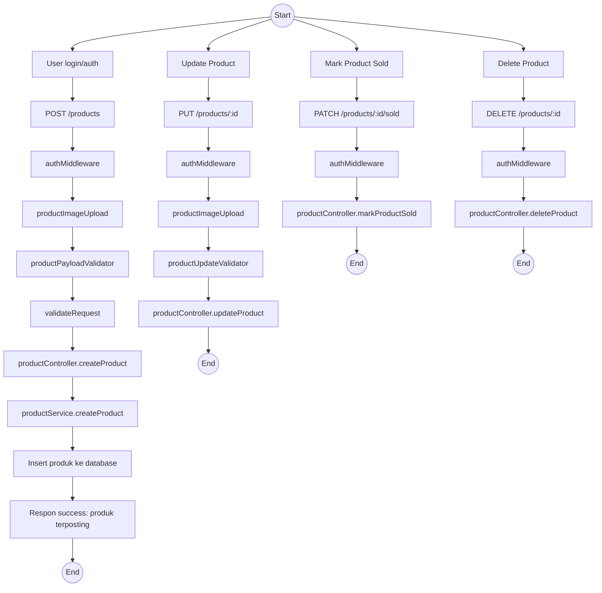
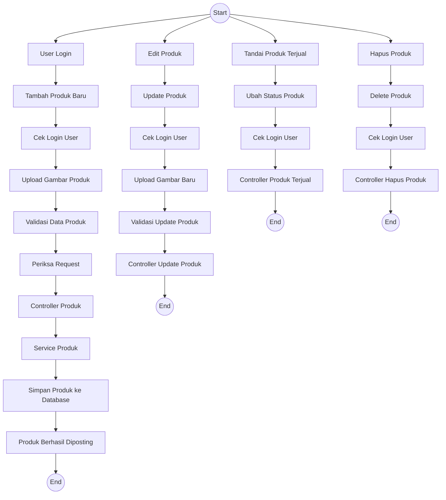
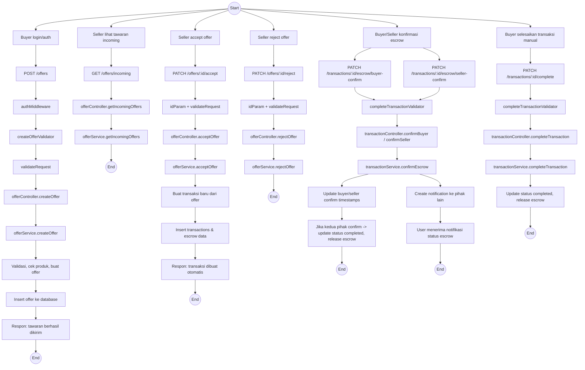
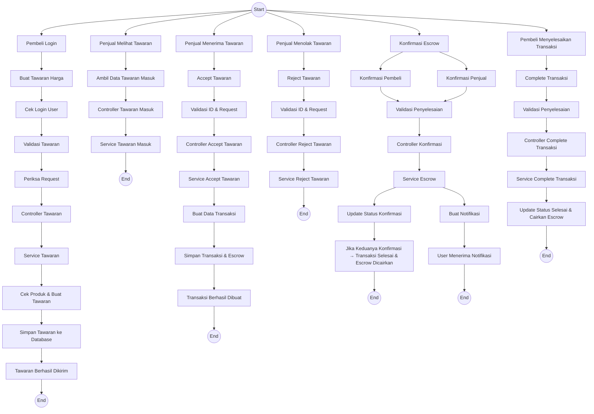
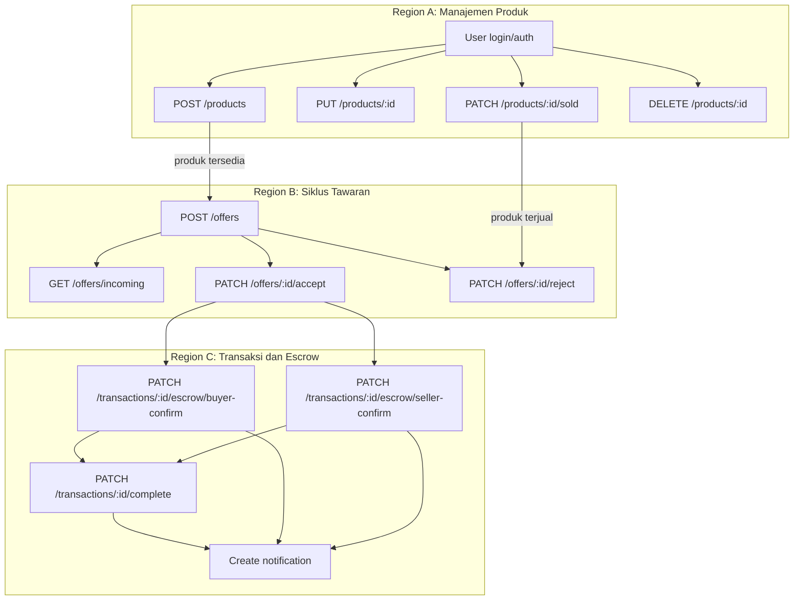

# Diagram Alur Pemesanan dan Pemostingan Barang - BabePus

Diagram berikut menggambarkan alur backend untuk:
1. Pemostingan barang baru oleh penjual
2. Proses pemesanan barang oleh pembeli melalui tawaran dan transaksi escrow

## A. Alur Pemostingan Barang

## easy to read

## B. Alur Pemesanan Barang

## easy to Read

## C. Basic Path Testing

Berikut adalah basic path testing yang disusun dari alur pemostingan dan pemesanan barang:

1. Posting Produk Baru
   - Start: User login/auth berhasil
   - Aksi: POST /products
   - Validasi: authMiddleware, productImageUpload, productPayloadValidator, validateRequest
   - Proses: productController.createProduct → productService.createProduct → insert produk ke database
   - Hasil: produk terposting sukses

2. Edit Produk
   - Start: User login/auth berhasil
   - Aksi: PUT /products/:id
   - Validasi: authMiddleware, productImageUpload, productUpdateValidator
   - Proses: productController.updateProduct
   - Hasil: produk terupdate

3. Tandai Produk Terjual
   - Start: User login/auth berhasil
   - Aksi: PATCH /products/:id/sold
   - Validasi: authMiddleware
   - Proses: productController.markProductSold
   - Hasil: produk ditandai terjual

4. Hapus Produk
   - Start: User login/auth berhasil
   - Aksi: DELETE /products/:id
   - Validasi: authMiddleware
   - Proses: productController.deleteProduct
   - Hasil: produk dihapus

5. Buat Tawaran Harga
   - Start: Buyer login/auth berhasil
   - Aksi: POST /offers
   - Validasi: authMiddleware, createOfferValidator, validateRequest
   - Proses: offerController.createOffer → offerService.createOffer → insert offer ke database
   - Hasil: tawaran terkirim

6. Lihat Tawaran Masuk
   - Start: Seller login/auth berhasil
   - Aksi: GET /offers/incoming
   - Proses: offerController.getIncomingOffers → offerService.getIncomingOffers
   - Hasil: daftar tawaran masuk tersedia

7. Terima Tawaran dan Buat Transaksi
   - Start: Seller login/auth berhasil
   - Aksi: PATCH /offers/:id/accept
   - Validasi: idParam + validateRequest
   - Proses: offerController.acceptOffer → offerService.acceptOffer → buat transaksi dan insert escrow
   - Hasil: transaksi dibuat otomatis

8. Tolak Tawaran
   - Start: Seller login/auth berhasil
   - Aksi: PATCH /offers/:id/reject
   - Validasi: idParam + validateRequest
   - Proses: offerController.rejectOffer → offerService.rejectOffer
   - Hasil: tawaran ditolak

9. Konfirmasi Escrow
   - Start: Buyer/Seller login/auth berhasil
   - Aksi: PATCH /transactions/:id/escrow/buyer-confirm atau PATCH /transactions/:id/escrow/seller-confirm
   - Validasi: completeTransactionValidator
   - Proses: transactionController.confirmBuyer / confirmSeller → transactionService.confirmEscrow → update timestamp
   - Hasil: jika kedua pihak konfirmasi, transaksi completed dan escrow dirilis

10. Selesaikan Transaksi Manual
    - Start: Buyer login/auth berhasil
    - Aksi: PATCH /transactions/:id/complete
    - Validasi: completeTransactionValidator
    - Proses: transactionController.completeTransaction → transactionService.completeTransaction → update status completed, release escrow
    - Hasil: transaksi selesai manual

11. Notifikasi Escrow
    - Start: Proses accept offer atau konfirmasi escrow
    - Proses: create notification ke pihak lain
    - Hasil: user menerima notifikasi

## D. Flow Graph dan Region

### Region
- Region A: Manajemen Produk
  - Meliputi posting, edit, mark sold, dan delete produk.
- Region B: Siklus Tawaran
  - Meliputi pembuatan tawaran, melihat tawaran, accept/reject tawaran.
- Region C: Transaksi dan Escrow
  - Meliputi konfirmasi escrow buyer/seller, complete transaksi manual, dan notifikasi.

### Struktur Pola
- Pola umum:
  1. Auth/identitas
  2. Validasi request
  3. Controller
  4. Service
  5. Database / output
- Pola aliran:
  - Sequence: fitur mengikuti urutan validasi → controller → service.
  - Branch: satu titik login bercabang ke produk, tawaran, transaksi.
  - Merge: jalur tawaran yang diterima bergabung ke region transaksi.
- Pola fungsional:
  - Produk: CRUD produk.
  - Tawaran: lifecycle penawaran.
  - Transaksi: escrow, konfirmasi, penyelesaian.
